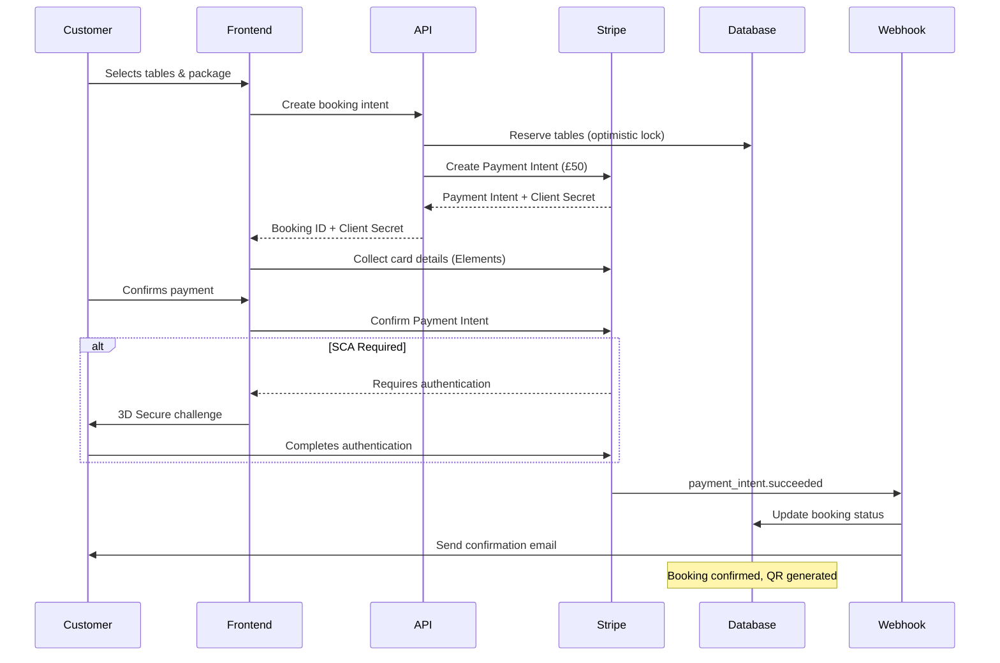

# Payment Processing & Integration Architecture

**Version**: 1.0  
**Date**: August 2025  
**Payment Provider**: Stripe Payment Intents API

## Executive Summary

This document defines the payment processing architecture for The Backroom Leeds, implementing a secure, PCI DSS compliant payment system with £50 deposit collection, UK-specific payment methods, and comprehensive fraud prevention.

## Payment Flow Architecture

### High-Level Payment Flow



## Core Payment Components

### 1. Payment Intent Creation

```typescript
// Payment Intent Service
import Stripe from 'stripe';
import { z } from 'zod';

const stripe = new Stripe(process.env.STRIPE_SECRET_KEY!, {
  apiVersion: '2023-10-16',
  typescript: true,
  maxNetworkRetries: 3,
  timeout: 10000,
});

// Payment validation schema
const PaymentIntentSchema = z.object({
  bookingId: z.string().uuid(),
  customerId: z.string().uuid(),
  amount: z.number().min(50).max(10000),
  currency: z.literal('gbp'),
  tables: z.array(z.string().uuid()).min(1).max(2),
  eventDate: z.string().datetime(),
  package: z.object({
    id: z.string().uuid(),
    price: z.number()
  }).optional(),
  metadata: z.record(z.string())
});

export class PaymentIntentService {
  private readonly DEPOSIT_AMOUNT = 5000; // £50 in pence
  private readonly idempotencyKey: string;
  
  async createBookingPaymentIntent(
    data: z.infer<typeof PaymentIntentSchema>
  ): Promise<Stripe.PaymentIntent> {
    // Validate input
    const validated = PaymentIntentSchema.parse(data);
    
    // Check for duplicate payment attempts
    const existingIntent = await this.checkExistingIntent(validated.bookingId);
    if (existingIntent) {
      return existingIntent;
    }
    
    // Calculate total amount
    const depositAmount = this.DEPOSIT_AMOUNT;
    const packageAmount = validated.package?.price || 0;
    const totalAmount = depositAmount; // Only collect deposit initially
    
    // Create Stripe customer if doesn't exist
    const stripeCustomer = await this.getOrCreateCustomer(validated.customerId);
    
    // Create payment intent with UK-specific configuration
    const paymentIntent = await stripe.paymentIntents.create({
      amount: totalAmount,
      currency: 'gbp',
      customer: stripeCustomer.id,
      
      // Payment method configuration for UK market
      payment_method_types: [
        'card',
        'bacs_debit', // UK bank debit
        'klarna',      // Buy now, pay later
        'afterpay_clearpay' // Popular in UK
      ],
      
      // Strong Customer Authentication (SCA) settings
      payment_method_options: {
        card: {
          request_three_d_secure: 'automatic',
          network: 'visa', // Preferred network for co-branded cards
          setup_future_usage: 'off_session', // Save for future charges
        },
        bacs_debit: {
          setup_future_usage: 'off_session'
        }
      },
      
      // Capture strategy
      capture_method: 'automatic', // Capture immediately
      
      // Metadata for webhook processing
      metadata: {
        booking_id: validated.bookingId,
        customer_id: validated.customerId,
        table_ids: JSON.stringify(validated.tables),
        event_date: validated.eventDate,
        package_id: validated.package?.id || '',
        package_amount: packageAmount.toString(),
        deposit_amount: depositAmount.toString(),
        booking_source: 'website',
        ...validated.metadata
      },
      
      // Fraud prevention
      radar_options: {
        session: await this.createRadarSession(validated)
      },
      
      // Statement descriptor
      statement_descriptor: 'BACKROOM LEEDS',
      statement_descriptor_suffix: 'DEPOSIT',
      
      // Application fee for platform
      application_fee_amount: Math.floor(totalAmount * 0.029 + 30), // Stripe fee
      
      // Idempotency for retries
      idempotency_key: this.generateIdempotencyKey(validated.bookingId)
    });
    
    // Store intent in database
    await this.storePaymentIntent(paymentIntent, validated);
    
    return paymentIntent;
  }
  
  private async createRadarSession(
    data: any
  ): Promise<string> {
    // Create Radar session for fraud detection
    const session = await stripe.radar.valueLists.create({
      alias: `booking_${data.bookingId}`,
      name: 'Booking fraud check',
      metadata: {
        customer_risk_score: await this.calculateRiskScore(data.customerId),
        booking_value: data.amount.toString(),
        is_first_booking: await this.isFirstBooking(data.customerId) ? 'true' : 'false'
      }
    });
    
    return session.id;
  }
  
  private async calculateRiskScore(customerId: string): Promise<string> {
    // Implement risk scoring algorithm
    const factors = await this.getRiskFactors(customerId);
    
    let score = 0;
    if (factors.isNewCustomer) score += 20;
    if (factors.hasChargebacks) score += 50;
    if (factors.unusualAmount) score += 30;
    if (factors.suspiciousPattern) score += 40;
    
    return score > 50 ? 'high' : score > 20 ? 'medium' : 'low';
  }
}
```

### 2. Payment Collection Frontend

```typescript
// React Payment Component with Stripe Elements
import { loadStripe } from '@stripe/stripe-js';
import {
  Elements,
  PaymentElement,
  useStripe,
  useElements
} from '@stripe/react-stripe-js';

const stripePromise = loadStripe(
  process.env.NEXT_PUBLIC_STRIPE_PUBLISHABLE_KEY!,
  {
    locale: 'en-GB',
    betas: ['payment_element_beta_1'],
    apiVersion: '2023-10-16'
  }
);

interface PaymentFormProps {
  clientSecret: string;
  bookingId: string;
  amount: number;
  onSuccess: (paymentIntent: any) => void;
  onError: (error: Error) => void;
}

export function PaymentForm({
  clientSecret,
  bookingId,
  amount,
  onSuccess,
  onError
}: PaymentFormProps) {
  const stripe = useStripe();
  const elements = useElements();
  const [processing, setProcessing] = useState(false);
  const [errorMessage, setErrorMessage] = useState<string | null>(null);
  
  const handleSubmit = async (event: FormEvent) => {
    event.preventDefault();
    
    if (!stripe || !elements) return;
    
    setProcessing(true);
    setErrorMessage(null);
    
    try {
      // Validate elements
      const { error: submitError } = await elements.submit();
      if (submitError) {
        throw new Error(submitError.message);
      }
      
      // Confirm payment with return URL for 3DS
      const { error, paymentIntent } = await stripe.confirmPayment({
        elements,
        clientSecret,
        confirmParams: {
          return_url: `${window.location.origin}/booking/confirmation`,
          payment_method_data: {
            billing_details: {
              email: customerEmail,
              name: customerName,
              phone: customerPhone,
              address: {
                city: 'Leeds',
                country: 'GB',
                line1: addressLine1,
                postal_code: postcode
              }
            }
          }
        },
        redirect: 'if_required' // Only redirect for 3DS
      });
      
      if (error) {
        // Handle specific error types
        if (error.type === 'card_error') {
          setErrorMessage(getCardErrorMessage(error.code));
        } else if (error.type === 'validation_error') {
          setErrorMessage('Please check your payment details');
        } else {
          setErrorMessage(error.message || 'Payment failed');
        }
        onError(new Error(error.message));
      } else if (paymentIntent) {
        // Payment succeeded
        onSuccess(paymentIntent);
      }
    } catch (err) {
      setErrorMessage('An unexpected error occurred');
      onError(err as Error);
    } finally {
      setProcessing(false);
    }
  };
  
  return (
    <form onSubmit={handleSubmit} className="payment-form">
      <div className="payment-header">
        <h3>Secure Payment</h3>
        <div className="payment-badges">
          
          
          
          
        </div>
      </div>
      
      <PaymentElement 
        options={{
          layout: 'tabs',
          defaultValues: {
            billingDetails: {
              address: {
                country: 'GB'
              }
            }
          },
          wallets: {
            applePay: 'auto',
            googlePay: 'auto'
          },
          terms: {
            card: 'auto',
            bacs_debit: 'auto'
          },
          fields: {
            billingDetails: {
              address: {
                country: 'never'
              }
            }
          }
        }}
      />
      
      {errorMessage && (
        <div className="error-message" role="alert">
          {errorMessage}
        </div>
      )}
      
      <div className="payment-summary">
        <div className="summary-line">
          <span>Deposit Amount:</span>
          <span>£{(amount / 100).toFixed(2)}</span>
        </div>
        <div className="summary-note">
          Remaining balance due on arrival
        </div>
      </div>
      
      <button
        type="submit"
        disabled={!stripe || processing}
        className="payment-button"
      >
        {processing ? (
          <span className="processing">
            <Spinner /> Processing...
          </span>
        ) : (
          `Pay £${(amount / 100).toFixed(2)} Deposit`
        )}
      </button>
      
      <div className="payment-security">
        <Lock className="w-4 h-4" />
        <span>Secured by Stripe. PCI DSS compliant.</span>
      </div>
    </form>
  );
}

// Wrapper component with Elements provider
export function PaymentContainer({ bookingData }: { bookingData: BookingData }) {
  const [clientSecret, setClientSecret] = useState<string | null>(null);
  
  useEffect(() => {
    // Create payment intent on mount
    createPaymentIntent(bookingData)
      .then(({ clientSecret }) => setClientSecret(clientSecret))
      .catch(console.error);
  }, [bookingData]);
  
  if (!clientSecret) {
    return <PaymentSkeleton />;
  }
  
  return (
    <Elements
      stripe={stripePromise}
      options={{
        clientSecret,
        appearance: {
          theme: 'night',
          variables: {
            colorPrimary: '#D4AF37',
            colorBackground: '#1A1A1A',
            colorText: '#FFFFFF',
            colorDanger: '#DF1B41',
            fontFamily: 'Inter, system-ui, sans-serif',
            spacingUnit: '4px',
            borderRadius: '8px',
          },
          rules: {
            '.Tab': {
              border: '1px solid #424242',
              boxShadow: '0px 1px 1px rgba(0, 0, 0, 0.03)',
            },
            '.Tab:hover': {
              color: '#D4AF37',
            },
            '.Tab--selected': {
              borderColor: '#D4AF37',
              boxShadow: '0px 1px 1px rgba(0, 0, 0, 0.03), 0px 0px 0px 1px #D4AF37',
            },
          }
        },
        loader: 'auto'
      }}
    >
      <PaymentForm
        clientSecret={clientSecret}
        bookingId={bookingData.id}
        amount={5000}
        onSuccess={handlePaymentSuccess}
        onError={handlePaymentError}
      />
    </Elements>
  );
}
```

### 3. Webhook Processing

```typescript
// Stripe Webhook Handler
import { NextRequest, NextResponse } from 'next/server';
import Stripe from 'stripe';
import { createClient } from '@supabase/supabase-js';

const stripe = new Stripe(process.env.STRIPE_SECRET_KEY!);
const endpointSecret = process.env.STRIPE_WEBHOOK_SECRET!;

export async function POST(request: NextRequest) {
  const body = await request.text();
  const signature = request.headers.get('stripe-signature')!;
  
  let event: Stripe.Event;
  
  try {
    // Verify webhook signature
    event = stripe.webhooks.constructEvent(
      body,
      signature,
      endpointSecret
    );
  } catch (err) {
    console.error('Webhook signature verification failed:', err);
    return NextResponse.json(
      { error: 'Invalid signature' },
      { status: 400 }
    );
  }
  
  // Initialize Supabase client with service role
  const supabase = createClient(
    process.env.NEXT_PUBLIC_SUPABASE_URL!,
    process.env.SUPABASE_SERVICE_ROLE_KEY!,
    {
      auth: {
        autoRefreshToken: false,
        persistSession: false
      }
    }
  );
  
  // Process webhook based on event type
  try {
    switch (event.type) {
      case 'payment_intent.succeeded':
        await handlePaymentSucceeded(event.data.object as Stripe.PaymentIntent, supabase);
        break;
        
      case 'payment_intent.payment_failed':
        await handlePaymentFailed(event.data.object as Stripe.PaymentIntent, supabase);
        break;
        
      case 'charge.dispute.created':
        await handleDisputeCreated(event.data.object as Stripe.Dispute, supabase);
        break;
        
      case 'charge.refunded':
        await handleRefund(event.data.object as Stripe.Charge, supabase);
        break;
        
      case 'payment_method.attached':
        await handlePaymentMethodAttached(event.data.object as Stripe.PaymentMethod, supabase);
        break;
        
      default:
        console.log(`Unhandled event type: ${event.type}`);
    }
    
    return NextResponse.json({ received: true });
  } catch (error) {
    console.error('Webhook processing error:', error);
    return NextResponse.json(
      { error: 'Webhook processing failed' },
      { status: 500 }
    );
  }
}

async function handlePaymentSucceeded(
  paymentIntent: Stripe.PaymentIntent,
  supabase: any
) {
  const { booking_id, customer_id, table_ids } = paymentIntent.metadata;
  
  // Start transaction
  const { data: booking, error: bookingError } = await supabase
    .from('bookings')
    .update({
      status: 'CONFIRMED',
      payment_intent_id: paymentIntent.id,
      deposit_amount: paymentIntent.amount / 100,
      confirmation_sent_at: new Date().toISOString()
    })
    .eq('id', booking_id)
    .single();
    
  if (bookingError) {
    throw new Error(`Failed to update booking: ${bookingError.message}`);
  }
  
  // Create payment record
  const { error: paymentError } = await supabase
    .from('payments')
    .insert({
      booking_id,
      stripe_payment_intent_id: paymentIntent.id,
      stripe_charge_id: paymentIntent.latest_charge,
      amount: paymentIntent.amount / 100,
      currency: paymentIntent.currency.toUpperCase(),
      type: 'DEPOSIT',
      status: 'COMPLETED',
      processed_at: new Date().toISOString(),
      metadata: {
        payment_method: paymentIntent.payment_method_types[0],
        customer_email: paymentIntent.receipt_email,
        risk_score: paymentIntent.outcome?.risk_score
      }
    });
    
  if (paymentError) {
    throw new Error(`Failed to create payment record: ${paymentError.message}`);
  }
  
  // Generate QR code for check-in
  const qrCode = await generateBookingQRCode(booking_id);
  
  await supabase
    .from('bookings')
    .update({ qr_code: qrCode })
    .eq('id', booking_id);
  
  // Send confirmation email
  await sendBookingConfirmation({
    bookingId: booking_id,
    customerId: customer_id,
    qrCode,
    tables: JSON.parse(table_ids),
    amount: paymentIntent.amount / 100
  });
  
  // Trigger real-time update
  await supabase
    .from('booking_updates')
    .insert({
      booking_id,
      event_type: 'PAYMENT_CONFIRMED',
      data: { payment_intent_id: paymentIntent.id }
    });
}

async function handlePaymentFailed(
  paymentIntent: Stripe.PaymentIntent,
  supabase: any
) {
  const { booking_id } = paymentIntent.metadata;
  
  // Update booking status
  await supabase
    .from('bookings')
    .update({
      status: 'PAYMENT_FAILED',
      internal_notes: `Payment failed: ${paymentIntent.last_payment_error?.message}`
    })
    .eq('id', booking_id);
  
  // Release table reservations after grace period
  setTimeout(async () => {
    const { data: booking } = await supabase
      .from('bookings')
      .select('status')
      .eq('id', booking_id)
      .single();
      
    if (booking?.status === 'PAYMENT_FAILED') {
      await releaseTableReservations(booking_id, supabase);
    }
  }, 30 * 60 * 1000); // 30 minutes grace period
  
  // Send payment failure notification
  await sendPaymentFailureNotification({
    bookingId: booking_id,
    reason: paymentIntent.last_payment_error?.message
  });
}

async function handleDisputeCreated(
  dispute: Stripe.Dispute,
  supabase: any
) {
  const paymentIntentId = dispute.payment_intent as string;
  
  // Find associated booking
  const { data: payment } = await supabase
    .from('payments')
    .select('booking_id')
    .eq('stripe_payment_intent_id', paymentIntentId)
    .single();
    
  if (payment) {
    // Flag booking for review
    await supabase
      .from('bookings')
      .update({
        status: 'DISPUTED',
        internal_notes: `Dispute created: ${dispute.reason}`
      })
      .eq('id', payment.booking_id);
    
    // Notify management
    await notifyManagement({
      type: 'DISPUTE',
      bookingId: payment.booking_id,
      disputeId: dispute.id,
      amount: dispute.amount / 100,
      reason: dispute.reason
    });
  }
}
```

### 4. Refund Processing

```typescript
// Refund Service
export class RefundService {
  private stripe: Stripe;
  private supabase: SupabaseClient;
  
  async processRefund(
    bookingId: string,
    reason: string,
    amount?: number
  ): Promise<RefundResult> {
    // Fetch booking and payment details
    const { data: booking } = await this.supabase
      .from('bookings')
      .select(`
        *,
        payments (*)
      `)
      .eq('id', bookingId)
      .single();
      
    if (!booking) {
      throw new Error('Booking not found');
    }
    
    const payment = booking.payments.find(p => p.type === 'DEPOSIT');
    if (!payment) {
      throw new Error('No payment found for booking');
    }
    
    // Check cancellation policy
    const hoursUntilEvent = this.calculateHoursUntilEvent(booking.event_date);
    const refundAmount = this.calculateRefundAmount(
      payment.amount,
      hoursUntilEvent,
      amount
    );
    
    if (refundAmount === 0) {
      return {
        success: false,
        reason: 'Outside cancellation window'
      };
    }
    
    try {
      // Create Stripe refund
      const refund = await this.stripe.refunds.create({
        payment_intent: payment.stripe_payment_intent_id,
        amount: Math.round(refundAmount * 100), // Convert to pence
        reason: this.mapRefundReason(reason),
        metadata: {
          booking_id: bookingId,
          original_amount: payment.amount.toString(),
          refund_reason: reason
        }
      });
      
      // Update payment record
      await this.supabase
        .from('payments')
        .update({
          refunded_amount: refundAmount,
          refund_reason: reason,
          refunded_at: new Date().toISOString(),
          status: 'REFUNDED'
        })
        .eq('id', payment.id);
      
      // Update booking status
      await this.supabase
        .from('bookings')
        .update({
          status: 'CANCELLED',
          cancelled_at: new Date().toISOString(),
          cancellation_reason: reason,
          refund_amount: refundAmount
        })
        .eq('id', bookingId);
      
      // Release table reservations
      await this.releaseTableReservations(bookingId);
      
      // Send refund confirmation
      await this.sendRefundConfirmation({
        bookingId,
        refundAmount,
        reason
      });
      
      return {
        success: true,
        refundId: refund.id,
        amount: refundAmount
      };
    } catch (error) {
      console.error('Refund processing error:', error);
      throw new Error('Failed to process refund');
    }
  }
  
  private calculateRefundAmount(
    originalAmount: number,
    hoursUntilEvent: number,
    requestedAmount?: number
  ): number {
    // Cancellation policy:
    // - 48+ hours: Full refund
    // - 24-48 hours: 50% refund
    // - <24 hours: No refund
    
    let refundPercentage = 0;
    
    if (hoursUntilEvent >= 48) {
      refundPercentage = 100;
    } else if (hoursUntilEvent >= 24) {
      refundPercentage = 50;
    }
    
    const calculatedAmount = (originalAmount * refundPercentage) / 100;
    
    // If specific amount requested, use minimum
    if (requestedAmount !== undefined) {
      return Math.min(requestedAmount, calculatedAmount);
    }
    
    return calculatedAmount;
  }
  
  private mapRefundReason(reason: string): Stripe.RefundCreateParams.Reason {
    const reasonMap: Record<string, Stripe.RefundCreateParams.Reason> = {
      'customer_request': 'requested_by_customer',
      'duplicate': 'duplicate',
      'fraudulent': 'fraudulent',
      'event_cancelled': 'requested_by_customer'
    };
    
    return reasonMap[reason] || 'requested_by_customer';
  }
}
```

### 5. Recurring Payments & Subscriptions

```typescript
// VIP Membership Subscription Service
export class SubscriptionService {
  async createVIPMembership(
    customerId: string,
    tier: 'GOLD' | 'PLATINUM'
  ): Promise<Stripe.Subscription> {
    // Get or create Stripe customer
    const stripeCustomer = await this.getOrCreateCustomer(customerId);
    
    // Define price IDs for membership tiers
    const priceIds = {
      GOLD: process.env.STRIPE_GOLD_MEMBERSHIP_PRICE_ID!,
      PLATINUM: process.env.STRIPE_PLATINUM_MEMBERSHIP_PRICE_ID!
    };
    
    // Create subscription with trial period
    const subscription = await this.stripe.subscriptions.create({
      customer: stripeCustomer.id,
      items: [{ price: priceIds[tier] }],
      payment_behavior: 'default_incomplete',
      payment_settings: {
        save_default_payment_method: 'on_subscription'
      },
      trial_period_days: 7,
      metadata: {
        customer_id: customerId,
        membership_tier: tier
      },
      expand: ['latest_invoice.payment_intent']
    });
    
    // Store subscription in database
    await this.supabase
      .from('memberships')
      .insert({
        customer_id: customerId,
        stripe_subscription_id: subscription.id,
        tier,
        status: subscription.status,
        current_period_end: new Date(subscription.current_period_end * 1000),
        benefits: this.getMembershipBenefits(tier)
      });
    
    return subscription;
  }
  
  private getMembershipBenefits(tier: 'GOLD' | 'PLATINUM') {
    const benefits = {
      GOLD: {
        priority_booking: true,
        discount_percentage: 10,
        complimentary_drinks: 2,
        vip_events_access: false,
        dedicated_host: false
      },
      PLATINUM: {
        priority_booking: true,
        discount_percentage: 20,
        complimentary_drinks: 4,
        vip_events_access: true,
        dedicated_host: true
      }
    };
    
    return benefits[tier];
  }
}
```

## Security & Compliance

### PCI DSS Compliance

```typescript
// PCI DSS Compliance Measures
export class PCIComplianceService {
  // Never store sensitive card data
  private readonly prohibitedFields = [
    'card_number',
    'cvv',
    'pin'
  ];
  
  // Tokenization service
  async tokenizeCardDetails(
    cardElement: any
  ): Promise<string> {
    // Use Stripe Elements to tokenize card data
    // Card details never touch our servers
    const { token, error } = await stripe.createToken(cardElement);
    
    if (error) {
      throw new SecurityError('Card tokenization failed');
    }
    
    return token.id;
  }
  
  // Audit logging for compliance
  async logPaymentActivity(
    activity: PaymentActivity
  ): Promise<void> {
    await this.supabase
      .from('payment_audit_log')
      .insert({
        user_id: activity.userId,
        action: activity.action,
        ip_address: activity.ipAddress,
        user_agent: activity.userAgent,
        metadata: this.sanitizeMetadata(activity.metadata),
        timestamp: new Date().toISOString()
      });
  }
  
  // Data sanitization
  private sanitizeMetadata(metadata: any): any {
    const sanitized = { ...metadata };
    
    // Remove any sensitive fields
    this.prohibitedFields.forEach(field => {
      delete sanitized[field];
    });
    
    // Mask card numbers if present
    if (sanitized.last_four) {
      sanitized.card_display = `****-****-****-${sanitized.last_four}`;
      delete sanitized.last_four;
    }
    
    return sanitized;
  }
  
  // Network segmentation
  async validatePaymentRequest(
    request: Request
  ): Promise<boolean> {
    // Check if request comes from allowed network
    const allowedNetworks = [
      '10.0.0.0/8',    // Internal network
      '172.16.0.0/12', // Docker network
      '192.168.0.0/16' // Local development
    ];
    
    const clientIP = request.headers.get('x-forwarded-for');
    const isAllowed = allowedNetworks.some(network => 
      this.isIPInRange(clientIP, network)
    );
    
    if (!isAllowed) {
      await this.logSecurityEvent({
        type: 'UNAUTHORIZED_PAYMENT_ACCESS',
        ip: clientIP,
        timestamp: new Date()
      });
      
      return false;
    }
    
    return true;
  }
}
```

### Strong Customer Authentication (SCA)

```typescript
// SCA Implementation for UK/EU Compliance
export class SCAService {
  async requiresAuthentication(
    amount: number,
    customer: Customer
  ): Promise<boolean> {
    // SCA required for payments over £30
    if (amount > 3000) { // Amount in pence
      return true;
    }
    
    // Check for exemptions
    const exemptions = await this.checkExemptions(customer);
    
    // Low-value exemption (under £30)
    if (amount <= 3000 && exemptions.lowValue) {
      return false;
    }
    
    // Trusted beneficiary exemption
    if (exemptions.trustedBeneficiary) {
      return false;
    }
    
    // Transaction risk analysis exemption
    const riskScore = await this.calculateTransactionRisk(amount, customer);
    if (riskScore < 30 && exemptions.lowRisk) {
      return false;
    }
    
    return true;
  }
  
  async handle3DSecure(
    paymentIntentId: string
  ): Promise<ThreeDSecureResult> {
    const paymentIntent = await stripe.paymentIntents.retrieve(
      paymentIntentId,
      { expand: ['payment_method'] }
    );
    
    if (paymentIntent.status === 'requires_action') {
      return {
        requiresAction: true,
        clientSecret: paymentIntent.client_secret,
        actionType: '3d_secure_redirect'
      };
    }
    
    return {
      requiresAction: false,
      authenticated: true
    };
  }
}
```

## Error Handling & Recovery

### Payment Error Recovery

```typescript
// Comprehensive Error Handling
export class PaymentErrorHandler {
  private readonly maxRetries = 3;
  private readonly retryDelays = [1000, 5000, 15000]; // Exponential backoff
  
  async handlePaymentError(
    error: any,
    context: PaymentContext
  ): Promise<ErrorRecoveryResult> {
    const errorType = this.classifyError(error);
    
    switch (errorType) {
      case 'INSUFFICIENT_FUNDS':
        return await this.handleInsufficientFunds(context);
        
      case 'CARD_DECLINED':
        return await this.handleCardDeclined(context);
        
      case 'NETWORK_ERROR':
        return await this.handleNetworkError(context);
        
      case 'RATE_LIMIT':
        return await this.handleRateLimit(context);
        
      case 'INVALID_REQUEST':
        return await this.handleInvalidRequest(context);
        
      default:
        return await this.handleUnknownError(error, context);
    }
  }
  
  private async handleInsufficientFunds(
    context: PaymentContext
  ): Promise<ErrorRecoveryResult> {
    // Offer alternative payment methods
    const alternatives = await this.getAlternativePaymentMethods(
      context.customerId
    );
    
    if (alternatives.length > 0) {
      return {
        recoverable: true,
        action: 'USE_ALTERNATIVE_PAYMENT',
        alternatives,
        message: 'Your card has insufficient funds. Please try another payment method.'
      };
    }
    
    // Offer payment plan
    const paymentPlan = await this.createPaymentPlan(context);
    
    return {
      recoverable: true,
      action: 'OFFER_PAYMENT_PLAN',
      paymentPlan,
      message: 'Would you like to split this payment into installments?'
    };
  }
  
  private async handleNetworkError(
    context: PaymentContext
  ): Promise<ErrorRecoveryResult> {
    // Implement retry with exponential backoff
    for (let attempt = 0; attempt < this.maxRetries; attempt++) {
      await this.delay(this.retryDelays[attempt]);
      
      try {
        const result = await this.retryPayment(context);
        if (result.success) {
          return {
            recoverable: true,
            action: 'RETRY_SUCCESS',
            message: 'Payment processed successfully after retry'
          };
        }
      } catch (retryError) {
        console.error(`Retry attempt ${attempt + 1} failed:`, retryError);
      }
    }
    
    // Store for offline processing
    await this.queueForOfflineProcessing(context);
    
    return {
      recoverable: true,
      action: 'QUEUED_FOR_PROCESSING',
      message: 'Payment will be processed when connection is restored'
    };
  }
}
```

## Monitoring & Analytics

### Payment Metrics Dashboard

```typescript
// Real-time Payment Analytics
export class PaymentAnalytics {
  async getPaymentMetrics(
    timeRange: TimeRange
  ): Promise<PaymentMetrics> {
    const metrics = await this.supabase
      .rpc('calculate_payment_metrics', {
        start_date: timeRange.start,
        end_date: timeRange.end
      });
    
    return {
      totalRevenue: metrics.total_revenue,
      averageTransactionValue: metrics.avg_transaction,
      conversionRate: metrics.conversion_rate,
      failureRate: metrics.failure_rate,
      refundRate: metrics.refund_rate,
      fraudRate: metrics.fraud_rate,
      
      paymentMethods: {
        card: metrics.card_percentage,
        bacs: metrics.bacs_percentage,
        klarna: metrics.klarna_percentage
      },
      
      processingTimes: {
        p50: metrics.processing_p50,
        p95: metrics.processing_p95,
        p99: metrics.processing_p99
      },
      
      topFailureReasons: metrics.top_failure_reasons,
      
      hourlyDistribution: metrics.hourly_distribution,
      
      customerMetrics: {
        newCustomers: metrics.new_customers,
        repeatCustomers: metrics.repeat_customers,
        averageLifetimeValue: metrics.avg_ltv
      }
    };
  }
  
  async trackPaymentEvent(
    event: PaymentEvent
  ): Promise<void> {
    // Send to analytics pipeline
    await Promise.all([
      this.sendToDatadog(event),
      this.sendToAmplitude(event),
      this.sendToSegment(event),
      this.storeInDatabase(event)
    ]);
  }
}
```

## Testing Strategy

### Payment Testing Suite

```typescript
// Comprehensive Payment Testing
describe('Payment Processing', () => {
  describe('Payment Intent Creation', () => {
    it('should create payment intent with correct amount', async () => {
      const booking = createMockBooking();
      const intent = await paymentService.createPaymentIntent(booking);
      
      expect(intent.amount).toBe(5000); // £50 in pence
      expect(intent.currency).toBe('gbp');
      expect(intent.metadata.booking_id).toBe(booking.id);
    });
    
    it('should handle SCA requirements', async () => {
      const booking = createMockBooking({ amount: 10000 });
      const intent = await paymentService.createPaymentIntent(booking);
      
      expect(intent.payment_method_options.card.request_three_d_secure)
        .toBe('automatic');
    });
    
    it('should prevent duplicate payments', async () => {
      const booking = createMockBooking();
      
      const intent1 = await paymentService.createPaymentIntent(booking);
      const intent2 = await paymentService.createPaymentIntent(booking);
      
      expect(intent1.id).toBe(intent2.id);
    });
  });
  
  describe('Webhook Processing', () => {
    it('should confirm booking on successful payment', async () => {
      const webhook = createMockWebhook('payment_intent.succeeded');
      
      await webhookHandler.process(webhook);
      
      const booking = await getBooking(webhook.metadata.booking_id);
      expect(booking.status).toBe('CONFIRMED');
    });
    
    it('should handle refunds correctly', async () => {
      const booking = createConfirmedBooking();
      
      const refund = await refundService.processRefund(
        booking.id,
        'customer_request'
      );
      
      expect(refund.success).toBe(true);
      expect(refund.amount).toBe(50); // Full refund
    });
  });
});
```

## Deployment Configuration

### Environment Variables

```bash
# Stripe Configuration
STRIPE_PUBLISHABLE_KEY=pk_live_xxx
STRIPE_SECRET_KEY=sk_live_xxx
STRIPE_WEBHOOK_SECRET=whsec_xxx
STRIPE_API_VERSION=2023-10-16

# Membership Price IDs
STRIPE_GOLD_MEMBERSHIP_PRICE_ID=price_xxx
STRIPE_PLATINUM_MEMBERSHIP_PRICE_ID=price_xxx

# Payment Configuration
PAYMENT_DEPOSIT_AMOUNT=5000
PAYMENT_CURRENCY=gbp
PAYMENT_CAPTURE_METHOD=automatic
PAYMENT_CONFIRMATION_URI=https://thebackroomleeds.com/booking/confirmation

# Fraud Prevention
RADAR_ENABLED=true
RADAR_RISK_THRESHOLD=65
REQUIRE_3DS_ABOVE_AMOUNT=3000

# Refund Policy
REFUND_WINDOW_HOURS=48
REFUND_PARTIAL_WINDOW_HOURS=24
REFUND_PARTIAL_PERCENTAGE=50
```

---

*Payment architecture designed for The Backroom Leeds by Claude Opus 4.1 Architecture Agent*