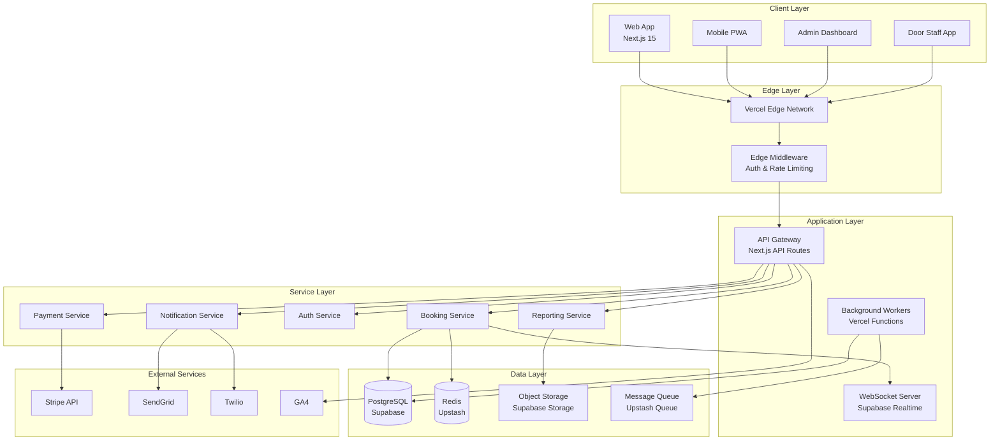

# Core System Architecture - The Backroom Leeds

**Version**: 1.0  
**Date**: August 2025  
**Architecture Agent**: Claude Opus 4.1

## Executive Summary

This document defines the core system architecture for The Backroom Leeds nightclub booking platform, implementing a modern event-driven architecture with real-time capabilities, optimized for high-traffic nightclub operations with 16 tables across two floors.

## System Overview

### Architecture Style
- **Pattern**: Microservices with Event-Driven Architecture
- **Communication**: REST APIs with WebSocket real-time updates
- **State Management**: Event Sourcing with CQRS pattern
- **Deployment**: Serverless with Edge Computing

### Core Principles
1. **Scalability First**: Handle 1000+ concurrent bookings
2. **Real-time Updates**: Sub-100ms latency for availability changes
3. **Fault Tolerance**: Graceful degradation with circuit breakers
4. **Security by Design**: Zero-trust architecture with defense in depth

## High-Level Architecture



## Component Architecture

### 1. Booking System Core

```typescript
// Domain Model
interface TableEntity {
  id: string;
  floor: 'upstairs' | 'downstairs';
  number: number;
  capacity: {
    min: number;
    max: number;
    optimal: number;
  };
  features: string[];
  status: 'available' | 'reserved' | 'occupied' | 'maintenance';
  position: {
    x: number;
    y: number;
    zone: string;
  };
}

interface BookingAggregate {
  id: string;
  customerId: string;
  tables: TableEntity[];
  eventDate: Date;
  timeSlot: {
    start: string;
    end: string;
  };
  status: BookingStatus;
  payment: PaymentDetails;
  package?: DrinksPackage;
  specialRequests: string;
  qrCode: string;
  checkIn?: CheckInDetails;
}

// Event Sourcing
interface BookingEvent {
  aggregateId: string;
  eventType: BookingEventType;
  eventData: any;
  timestamp: Date;
  userId: string;
  metadata: EventMetadata;
}

enum BookingEventType {
  BOOKING_INITIATED = 'BOOKING_INITIATED',
  TABLES_SELECTED = 'TABLES_SELECTED',
  PAYMENT_PROCESSED = 'PAYMENT_PROCESSED',
  BOOKING_CONFIRMED = 'BOOKING_CONFIRMED',
  BOOKING_CANCELLED = 'BOOKING_CANCELLED',
  GUEST_CHECKED_IN = 'GUEST_CHECKED_IN',
  BOOKING_COMPLETED = 'BOOKING_COMPLETED'
}
```

### 2. Real-time Availability Engine

```typescript
// Real-time Table Availability
class AvailabilityEngine {
  private subscriptions: Map<string, RealtimeChannel>;
  private cache: AvailabilityCache;
  private locks: OptimisticLockManager;
  
  async checkAvailability(
    date: Date,
    partySize: number,
    preferences?: TablePreferences
  ): Promise<AvailableTableSet[]> {
    // Implement AI-powered table assignment
    const aiSuggestions = await this.aiTableAssignment(partySize, preferences);
    
    // Check real-time availability with optimistic locking
    const available = await this.locks.withLock(async () => {
      return await this.queryAvailableTables(date, aiSuggestions);
    });
    
    // Subscribe to real-time updates
    this.subscribeToTableUpdates(date, available);
    
    return available;
  }
  
  private async aiTableAssignment(
    partySize: number,
    preferences?: TablePreferences
  ): Promise<TableAssignment[]> {
    // ML model for optimal table assignment
    return await this.mlModel.predict({
      partySize,
      preferences,
      historicalData: await this.getHistoricalPatterns(),
      currentOccupancy: await this.getCurrentOccupancy()
    });
  }
}
```

### 3. Payment Processing Architecture

```typescript
// Stripe Payment Integration
class PaymentProcessor {
  private stripe: Stripe;
  private webhookHandler: WebhookHandler;
  
  async createPaymentIntent(
    booking: BookingAggregate,
    amount: number
  ): Promise<PaymentIntent> {
    // Implement Strong Customer Authentication (SCA)
    const intent = await this.stripe.paymentIntents.create({
      amount: amount * 100, // Convert to pence
      currency: 'gbp',
      customer: booking.customerId,
      metadata: {
        bookingId: booking.id,
        tables: JSON.stringify(booking.tables.map(t => t.id)),
        eventDate: booking.eventDate.toISOString()
      },
      payment_method_types: ['card'],
      setup_future_usage: 'on_session',
      // SCA compliance
      payment_method_options: {
        card: {
          request_three_d_secure: 'automatic'
        }
      }
    });
    
    // Store intent for webhook processing
    await this.storePaymentIntent(intent, booking);
    
    return intent;
  }
  
  async handleWebhook(event: Stripe.Event): Promise<void> {
    switch (event.type) {
      case 'payment_intent.succeeded':
        await this.confirmBookingPayment(event.data.object);
        break;
      case 'payment_intent.payment_failed':
        await this.handlePaymentFailure(event.data.object);
        break;
      case 'charge.dispute.created':
        await this.handleDispute(event.data.object);
        break;
    }
  }
}
```

### 4. Authentication & Authorization

```typescript
// Multi-tier Role-Based Access Control
interface RoleHierarchy {
  SUPER_ADMIN: {
    permissions: string[];
    inherits: null;
  };
  MANAGER: {
    permissions: string[];
    inherits: 'DOOR_STAFF';
  };
  DOOR_STAFF: {
    permissions: string[];
    inherits: null;
  };
  CUSTOMER: {
    permissions: string[];
    inherits: null;
  };
}

class AuthorizationService {
  private supabaseAuth: SupabaseAuthClient;
  private totpService: TOTPService;
  
  async authenticate(
    credentials: Credentials,
    require2FA: boolean = false
  ): Promise<AuthSession> {
    // Primary authentication
    const { user, session } = await this.supabaseAuth.signIn(credentials);
    
    // 2FA for admin users
    if (require2FA && this.isAdminUser(user)) {
      const totpValid = await this.totpService.verify(
        user.id,
        credentials.totpCode
      );
      
      if (!totpValid) {
        throw new AuthenticationError('Invalid 2FA code');
      }
    }
    
    // Generate JWT with role claims
    const token = await this.generateToken(user, session);
    
    return {
      user,
      token,
      permissions: await this.loadPermissions(user.role)
    };
  }
  
  async authorize(
    user: User,
    resource: string,
    action: string
  ): Promise<boolean> {
    // Row Level Security (RLS) integration
    const policy = await this.getRLSPolicy(resource, action);
    return policy.evaluate(user);
  }
}
```

### 5. Event-Driven Messaging

```typescript
// Event Bus Architecture
class EventBus {
  private channels: Map<string, EventChannel>;
  private handlers: Map<string, EventHandler[]>;
  
  async publish<T extends DomainEvent>(
    event: T,
    options?: PublishOptions
  ): Promise<void> {
    const channel = this.getChannel(event.aggregateType);
    
    // Publish with guaranteed delivery
    await channel.publish(event, {
      ...options,
      retryPolicy: {
        maxAttempts: 3,
        backoffMultiplier: 2
      }
    });
    
    // Trigger real-time updates
    await this.broadcastRealtimeUpdate(event);
  }
  
  async subscribe<T extends DomainEvent>(
    eventType: string,
    handler: EventHandler<T>
  ): Promise<Subscription> {
    const subscription = await this.createSubscription(eventType);
    
    subscription.on('message', async (event: T) => {
      try {
        await handler(event);
        await subscription.ack(event);
      } catch (error) {
        await this.handleError(error, event);
      }
    });
    
    return subscription;
  }
}
```

## Data Architecture

### Database Schema Design

```sql
-- Core Tables with RLS Policies
CREATE TABLE tables (
  id UUID PRIMARY KEY DEFAULT gen_random_uuid(),
  floor VARCHAR(20) NOT NULL CHECK (floor IN ('upstairs', 'downstairs')),
  number INTEGER NOT NULL,
  capacity_min INTEGER NOT NULL,
  capacity_max INTEGER NOT NULL,
  capacity_optimal INTEGER NOT NULL,
  features JSONB DEFAULT '[]',
  position JSONB NOT NULL,
  status VARCHAR(20) DEFAULT 'available',
  created_at TIMESTAMPTZ DEFAULT NOW(),
  updated_at TIMESTAMPTZ DEFAULT NOW()
);

CREATE TABLE bookings (
  id UUID PRIMARY KEY DEFAULT gen_random_uuid(),
  customer_id UUID REFERENCES users(id),
  event_date DATE NOT NULL,
  time_slot TSTZRANGE NOT NULL,
  status VARCHAR(20) NOT NULL,
  payment_intent_id VARCHAR(255),
  deposit_amount DECIMAL(10, 2),
  total_amount DECIMAL(10, 2),
  package_id UUID REFERENCES drinks_packages(id),
  special_requests TEXT,
  qr_code VARCHAR(255) UNIQUE,
  metadata JSONB DEFAULT '{}',
  created_at TIMESTAMPTZ DEFAULT NOW(),
  updated_at TIMESTAMPTZ DEFAULT NOW(),
  EXCLUDE USING gist (time_slot WITH &&) WHERE (status = 'confirmed')
);

CREATE TABLE booking_tables (
  booking_id UUID REFERENCES bookings(id),
  table_id UUID REFERENCES tables(id),
  PRIMARY KEY (booking_id, table_id)
);

-- Row Level Security Policies
ALTER TABLE bookings ENABLE ROW LEVEL SECURITY;

CREATE POLICY "Customers can view own bookings"
  ON bookings FOR SELECT
  USING (auth.uid() = customer_id);

CREATE POLICY "Staff can view all bookings"
  ON bookings FOR SELECT
  USING (
    EXISTS (
      SELECT 1 FROM users
      WHERE id = auth.uid()
      AND role IN ('SUPER_ADMIN', 'MANAGER', 'DOOR_STAFF')
    )
  );

CREATE POLICY "Managers can update bookings"
  ON bookings FOR UPDATE
  USING (
    EXISTS (
      SELECT 1 FROM users
      WHERE id = auth.uid()
      AND role IN ('SUPER_ADMIN', 'MANAGER')
    )
  );

-- Indexes for Performance
CREATE INDEX idx_bookings_event_date ON bookings(event_date);
CREATE INDEX idx_bookings_status ON bookings(status);
CREATE INDEX idx_bookings_customer ON bookings(customer_id);
CREATE INDEX idx_tables_floor ON tables(floor);
CREATE INDEX idx_tables_status ON tables(status);

-- Triggers for Real-time Updates
CREATE OR REPLACE FUNCTION notify_booking_change()
RETURNS TRIGGER AS $$
BEGIN
  PERFORM pg_notify(
    'booking_updates',
    json_build_object(
      'operation', TG_OP,
      'booking_id', NEW.id,
      'tables', (
        SELECT array_agg(table_id)
        FROM booking_tables
        WHERE booking_id = NEW.id
      ),
      'event_date', NEW.event_date,
      'status', NEW.status
    )::text
  );
  RETURN NEW;
END;
$$ LANGUAGE plpgsql;

CREATE TRIGGER booking_change_trigger
AFTER INSERT OR UPDATE ON bookings
FOR EACH ROW EXECUTE FUNCTION notify_booking_change();
```

### Caching Strategy

```typescript
// Multi-layer Caching Architecture
class CacheManager {
  private l1Cache: MemoryCache; // In-memory cache
  private l2Cache: RedisCache;  // Distributed cache
  private cdnCache: EdgeCache;  // CDN edge cache
  
  async get<T>(
    key: string,
    options?: CacheOptions
  ): Promise<T | null> {
    // L1: Memory cache (fastest)
    let value = await this.l1Cache.get(key);
    if (value) return value;
    
    // L2: Redis cache
    value = await this.l2Cache.get(key);
    if (value) {
      await this.l1Cache.set(key, value, { ttl: 60 });
      return value;
    }
    
    // L3: Database query with cache refresh
    if (options?.loader) {
      value = await options.loader();
      await this.set(key, value, options);
      return value;
    }
    
    return null;
  }
  
  async invalidate(pattern: string): Promise<void> {
    // Cascade invalidation through all layers
    await Promise.all([
      this.l1Cache.invalidate(pattern),
      this.l2Cache.invalidate(pattern),
      this.cdnCache.purge(pattern)
    ]);
  }
}
```

## Security Architecture

### Defense in Depth

```typescript
// Security Layers
class SecurityManager {
  private rateLimiter: RateLimiter;
  private firewall: WebApplicationFirewall;
  private encryption: EncryptionService;
  private auditLogger: AuditLogger;
  
  async processRequest(
    request: Request,
    context: SecurityContext
  ): Promise<SecurityValidation> {
    // Layer 1: Rate Limiting
    await this.rateLimiter.check(request.ip, {
      windowMs: 15 * 60 * 1000, // 15 minutes
      max: 100 // Max requests per window
    });
    
    // Layer 2: WAF Rules
    const wafResult = await this.firewall.inspect(request);
    if (wafResult.blocked) {
      throw new SecurityException(wafResult.reason);
    }
    
    // Layer 3: Authentication & Authorization
    const authResult = await this.authenticate(request);
    const authorized = await this.authorize(authResult.user, context);
    
    // Layer 4: Input Validation
    const sanitized = await this.sanitizeInput(request.body);
    
    // Layer 5: Audit Logging
    await this.auditLogger.log({
      userId: authResult.user?.id,
      action: context.action,
      resource: context.resource,
      ip: request.ip,
      timestamp: new Date()
    });
    
    return {
      user: authResult.user,
      sanitizedInput: sanitized,
      permissions: authorized.permissions
    };
  }
}
```

### GDPR Compliance Architecture

```typescript
// Data Privacy Service
class PrivacyService {
  async handleDataRequest(
    requestType: 'ACCESS' | 'PORTABILITY' | 'ERASURE',
    userId: string
  ): Promise<DataRequestResult> {
    switch (requestType) {
      case 'ACCESS':
        return await this.exportUserData(userId);
      
      case 'PORTABILITY':
        return await this.generatePortableDataPackage(userId);
      
      case 'ERASURE':
        return await this.eraseUserData(userId, {
          preserveFinancialRecords: true, // 7-year retention
          anonymizeAnalytics: true
        });
    }
  }
  
  private async eraseUserData(
    userId: string,
    options: ErasureOptions
  ): Promise<ErasureResult> {
    const tasks = [
      this.anonymizeBookings(userId),
      this.deletePersonalData(userId),
      this.removeFromMarketing(userId),
      this.purgeCache(userId)
    ];
    
    if (!options.preserveFinancialRecords) {
      tasks.push(this.deleteFinancialRecords(userId));
    }
    
    const results = await Promise.all(tasks);
    
    // Audit trail for compliance
    await this.auditLogger.logErasure({
      userId,
      timestamp: new Date(),
      options,
      results
    });
    
    return {
      success: true,
      erasedData: results,
      retainedData: options.preserveFinancialRecords ? 
        ['financial_records'] : []
    };
  }
}
```

## Performance Architecture

### Optimization Strategies

```typescript
// Performance Optimization Layer
class PerformanceOptimizer {
  private metrics: MetricsCollector;
  private cdn: CDNManager;
  private preloader: ResourcePreloader;
  
  async optimizeResponse(
    response: Response,
    context: RequestContext
  ): Promise<OptimizedResponse> {
    // Image optimization
    if (response.contentType.includes('image')) {
      return await this.optimizeImage(response, {
        format: 'webp',
        quality: 85,
        sizes: [640, 750, 828, 1080, 1200]
      });
    }
    
    // JavaScript optimization
    if (response.contentType.includes('javascript')) {
      return await this.optimizeJavaScript(response, {
        minify: true,
        treeshake: true,
        splitChunks: true
      });
    }
    
    // API response optimization
    if (response.isApiResponse) {
      return await this.optimizeApiResponse(response, {
        compress: true,
        cache: true,
        preload: context.predictedNextRequests
      });
    }
    
    return response;
  }
  
  async monitorPerformance(): Promise<PerformanceMetrics> {
    return {
      coreWebVitals: {
        lcp: await this.metrics.getLCP(), // < 2.5s
        inp: await this.metrics.getINP(), // < 200ms
        cls: await this.metrics.getCLS(), // < 0.1
        fcp: await this.metrics.getFCP(), // < 1.8s
        ttfb: await this.metrics.getTTFB() // < 800ms
      },
      businessMetrics: {
        bookingConversion: await this.metrics.getConversionRate(),
        apiResponseTime: await this.metrics.getP95ResponseTime(),
        errorRate: await this.metrics.getErrorRate()
      }
    };
  }
}
```

## Scalability Architecture

### Auto-scaling Configuration

```yaml
# Vercel Function Scaling Configuration
functions:
  api/bookings/*:
    maxDuration: 30
    memory: 1024
    runtime: nodejs20.x
    regions:
      - lhr1  # London
      - cdg1  # Paris
      - fra1  # Frankfurt
    scaling:
      minInstances: 2
      maxInstances: 100
      targetConcurrency: 50

  api/payments/*:
    maxDuration: 60
    memory: 512
    runtime: nodejs20.x
    regions:
      - lhr1
    scaling:
      minInstances: 1
      maxInstances: 50
      targetConcurrency: 25

# Database Connection Pooling
database:
  pooling:
    mode: transaction
    pool_size: 25
    statement_cache_size: 100
    idle_timeout: 300
    max_lifetime: 3600
```

## Monitoring & Observability

### Telemetry Architecture

```typescript
// Comprehensive Monitoring System
class ObservabilityPlatform {
  private tracer: OpenTelemetryTracer;
  private logger: StructuredLogger;
  private metrics: PrometheusMetrics;
  private profiler: PerformanceProfiler;
  
  async instrumentRequest(
    request: Request,
    handler: RequestHandler
  ): Promise<Response> {
    const span = this.tracer.startSpan('http.request', {
      attributes: {
        'http.method': request.method,
        'http.url': request.url,
        'http.user_agent': request.headers['user-agent'],
        'user.id': request.userId
      }
    });
    
    try {
      // Execute with performance tracking
      const startTime = performance.now();
      const response = await handler(request);
      const duration = performance.now() - startTime;
      
      // Record metrics
      this.metrics.recordHttpRequest({
        method: request.method,
        route: request.route,
        status: response.status,
        duration
      });
      
      // Log structured data
      this.logger.info('Request completed', {
        requestId: request.id,
        userId: request.userId,
        duration,
        status: response.status
      });
      
      return response;
    } catch (error) {
      span.recordException(error);
      this.metrics.incrementErrorCounter(error.type);
      throw error;
    } finally {
      span.end();
    }
  }
}
```

## Deployment Architecture

### CI/CD Pipeline

```yaml
# GitHub Actions Deployment Pipeline
name: Deploy to Production

on:
  push:
    branches: [main]

jobs:
  test:
    runs-on: ubuntu-latest
    steps:
      - uses: actions/checkout@v3
      - name: Run Tests
        run: |
          npm ci
          npm run test:unit
          npm run test:integration
          npm run test:e2e

  security:
    runs-on: ubuntu-latest
    steps:
      - name: Security Scan
        run: |
          npm audit
          npm run security:scan

  deploy:
    needs: [test, security]
    runs-on: ubuntu-latest
    steps:
      - name: Deploy to Vercel
        env:
          VERCEL_TOKEN: ${{ secrets.VERCEL_TOKEN }}
        run: |
          vercel --prod --token=$VERCEL_TOKEN
      
      - name: Run Migrations
        run: |
          npx supabase db push
      
      - name: Invalidate Cache
        run: |
          npm run cache:purge
      
      - name: Health Check
        run: |
          npm run health:check
```

## Disaster Recovery

### Backup & Recovery Strategy

```typescript
// Automated Backup System
class DisasterRecoveryService {
  async performBackup(): Promise<BackupResult> {
    const backupTasks = [
      this.backupDatabase(),
      this.backupObjectStorage(),
      this.backupConfiguration(),
      this.backupAuditLogs()
    ];
    
    const results = await Promise.all(backupTasks);
    
    // Verify backup integrity
    await this.verifyBackupIntegrity(results);
    
    // Store in multiple locations
    await this.storeBackups(results, {
      primary: 's3://backroom-backups-primary',
      secondary: 'gcs://backroom-backups-secondary',
      tertiary: 'azure://backroom-backups-tertiary'
    });
    
    return {
      timestamp: new Date(),
      size: results.reduce((acc, r) => acc + r.size, 0),
      location: ['s3', 'gcs', 'azure'],
      rpo: '1 hour', // Recovery Point Objective
      rto: '4 hours' // Recovery Time Objective
    };
  }
}
```

## Architecture Decision Records (ADRs)

### ADR-001: Event-Driven Architecture
**Status**: Accepted  
**Decision**: Implement event-driven architecture with Event Sourcing and CQRS  
**Rationale**: Provides audit trail, enables real-time updates, supports complex booking workflows  

### ADR-002: Serverless Deployment
**Status**: Accepted  
**Decision**: Deploy on Vercel with Edge Functions  
**Rationale**: Auto-scaling, cost-effective, optimal for nightclub traffic patterns  

### ADR-003: Real-time via Supabase
**Status**: Accepted  
**Decision**: Use Supabase Realtime for WebSocket connections  
**Rationale**: Built-in RLS integration, PostgreSQL compatibility, managed infrastructure  

### ADR-004: Multi-tier Caching
**Status**: Accepted  
**Decision**: Implement L1 (memory), L2 (Redis), L3 (CDN) caching  
**Rationale**: Optimize for different access patterns, reduce database load  

## Success Metrics

### Technical KPIs
- API Response Time: P95 < 200ms
- Database Query Time: P95 < 50ms
- Cache Hit Rate: > 90%
- Error Rate: < 0.1%
- Availability: 99.9%

### Business KPIs
- Booking Conversion: 15-25%
- Page Load Time: < 2.5s
- Mobile Performance Score: > 90
- Customer Satisfaction: > 4.5/5

## Next Steps

1. Implement core booking service with event sourcing
2. Set up Supabase real-time subscriptions
3. Configure Stripe webhook handlers
4. Deploy monitoring and alerting
5. Conduct load testing and optimization

---

*Architecture designed for The Backroom Leeds by Claude Opus 4.1 Architecture Agent*