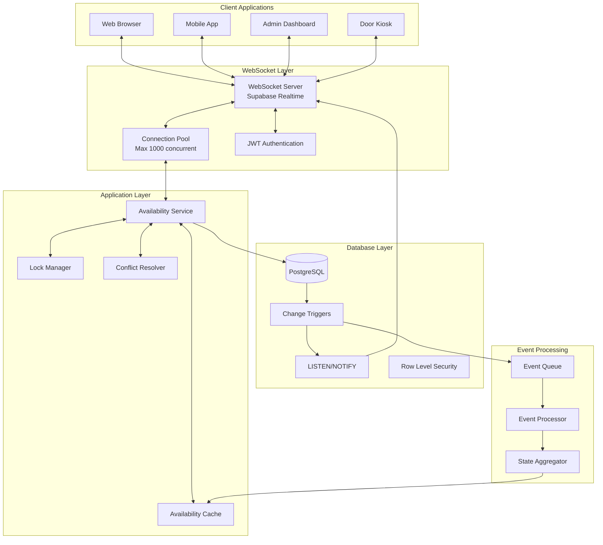

# Real-time Availability System Architecture

**Version**: 1.0  
**Date**: August 2025  
**Technology**: Supabase Realtime, PostgreSQL, WebSockets

## Executive Summary

This document defines the real-time table availability architecture for The Backroom Leeds, implementing a distributed event-driven system with optimistic locking, conflict resolution, and sub-100ms update propagation for 16 tables across two floors.

## System Architecture Overview

### Real-time Data Flow



## Core Components

### 1. WebSocket Connection Management

```typescript
// WebSocket Connection Manager
import { RealtimeClient, RealtimeChannel } from '@supabase/realtime-js';

export class RealtimeAvailabilityManager {
  private client: RealtimeClient;
  private channels: Map<string, RealtimeChannel>;
  private subscriptions: Map<string, Set<SubscriptionCallback>>;
  private heartbeatInterval: NodeJS.Timer;
  private reconnectStrategy: ReconnectStrategy;
  
  constructor() {
    this.client = new RealtimeClient(
      process.env.SUPABASE_REALTIME_URL!,
      {
        params: {
          apikey: process.env.SUPABASE_ANON_KEY!,
          eventsPerSecond: 10, // Rate limiting
        },
        heartbeatIntervalMs: 30000,
        timeout: 10000,
        encode: (payload) => JSON.stringify(payload),
        decode: (payload) => JSON.parse(payload),
        reconnectAfterMs: (tries) => {
          // Exponential backoff with jitter
          const baseDelay = Math.min(tries * 1000, 30000);
          const jitter = Math.random() * 1000;
          return baseDelay + jitter;
        }
      }
    );
    
    this.channels = new Map();
    this.subscriptions = new Map();
    this.setupHeartbeat();
    this.setupErrorHandling();
  }
  
  async subscribeToTableAvailability(
    date: Date,
    callback: SubscriptionCallback
  ): Promise<Subscription> {
    const channelName = `availability:${date.toISOString().split('T')[0]}`;
    
    // Get or create channel
    let channel = this.channels.get(channelName);
    if (!channel) {
      channel = this.createChannel(channelName, date);
      this.channels.set(channelName, channel);
    }
    
    // Add subscription
    const subscriptionId = crypto.randomUUID();
    const subscription: Subscription = {
      id: subscriptionId,
      channel: channelName,
      unsubscribe: () => this.unsubscribe(subscriptionId)
    };
    
    // Store callback
    if (!this.subscriptions.has(channelName)) {
      this.subscriptions.set(channelName, new Set());
    }
    this.subscriptions.get(channelName)!.add(callback);
    
    return subscription;
  }
  
  private createChannel(name: string, date: Date): RealtimeChannel {
    const channel = this.client.channel(name, {
      config: {
        broadcast: {
          self: false, // Don't receive own messages
          ack: true    // Acknowledge receipt
        },
        presence: {
          key: '' // Track connected users
        }
      }
    });
    
    // Subscribe to database changes
    channel.on(
      'postgres_changes',
      {
        event: '*',
        schema: 'public',
        table: 'table_availability',
        filter: `date=eq.${date.toISOString().split('T')[0]}`
      },
      (payload) => this.handleAvailabilityChange(name, payload)
    );
    
    // Subscribe to booking changes
    channel.on(
      'postgres_changes',
      {
        event: '*',
        schema: 'public',
        table: 'bookings',
        filter: `event_date=eq.${date.toISOString().split('T')[0]}`
      },
      (payload) => this.handleBookingChange(name, payload)
    );
    
    // Subscribe to broadcast messages
    channel.on(
      'broadcast',
      { event: 'table_lock' },
      (payload) => this.handleTableLock(name, payload)
    );
    
    channel.on(
      'broadcast',
      { event: 'table_release' },
      (payload) => this.handleTableRelease(name, payload)
    );
    
    // Track presence
    channel.on('presence', { event: 'sync' }, () => {
      const state = channel.presenceState();
      this.updatePresenceInfo(name, state);
    });
    
    // Subscribe to channel
    channel.subscribe(async (status) => {
      if (status === 'SUBSCRIBED') {
        console.log(`Subscribed to channel: ${name}`);
        await this.loadInitialState(name, date);
      } else if (status === 'CHANNEL_ERROR') {
        console.error(`Channel error: ${name}`);
        await this.handleChannelError(name);
      } else if (status === 'TIMED_OUT') {
        console.error(`Channel timeout: ${name}`);
        await this.reconnectChannel(name);
      }
    });
    
    return channel;
  }
  
  private async handleAvailabilityChange(
    channelName: string,
    payload: any
  ): Promise<void> {
    const callbacks = this.subscriptions.get(channelName);
    if (!callbacks) return;
    
    const change: AvailabilityChange = {
      type: payload.eventType,
      tableId: payload.new?.table_id || payload.old?.table_id,
      date: payload.new?.date || payload.old?.date,
      timeSlot: payload.new?.time_slot || payload.old?.time_slot,
      status: payload.new?.status,
      previousStatus: payload.old?.status,
      timestamp: new Date(payload.commit_timestamp)
    };
    
    // Notify all subscribers
    callbacks.forEach(callback => {
      try {
        callback(change);
      } catch (error) {
        console.error('Subscription callback error:', error);
      }
    });
  }
}
```

### 2. Optimistic Locking System

```typescript
// Optimistic Lock Manager
export class OptimisticLockManager {
  private locks: Map<string, TableLock>;
  private lockTimeout: number = 30000; // 30 seconds
  private cleanupInterval: NodeJS.Timer;
  
  constructor(private supabase: SupabaseClient) {
    this.locks = new Map();
    this.startCleanupProcess();
  }
  
  async acquireLock(
    tableId: string,
    userId: string,
    duration: number = this.lockTimeout
  ): Promise<LockResult> {
    const lockKey = this.getLockKey(tableId);
    const existingLock = this.locks.get(lockKey);
    
    // Check if table is already locked
    if (existingLock && !this.isLockExpired(existingLock)) {
      if (existingLock.userId === userId) {
        // Extend existing lock for same user
        existingLock.expiresAt = Date.now() + duration;
        return { success: true, lockId: existingLock.id, extended: true };
      }
      
      return {
        success: false,
        reason: 'TABLE_LOCKED',
        lockedBy: existingLock.userId,
        expiresIn: existingLock.expiresAt - Date.now()
      };
    }
    
    // Try to acquire database lock
    const dbLock = await this.acquireDatabaseLock(tableId, userId, duration);
    if (!dbLock.success) {
      return dbLock;
    }
    
    // Create local lock
    const lock: TableLock = {
      id: crypto.randomUUID(),
      tableId,
      userId,
      acquiredAt: Date.now(),
      expiresAt: Date.now() + duration,
      version: dbLock.version
    };
    
    this.locks.set(lockKey, lock);
    
    // Broadcast lock acquisition
    await this.broadcastLockEvent('acquired', lock);
    
    // Set auto-release timer
    setTimeout(() => {
      this.releaseLock(lockKey, userId);
    }, duration);
    
    return { success: true, lockId: lock.id, version: lock.version };
  }
  
  async releaseLock(
    tableId: string,
    userId: string
  ): Promise<boolean> {
    const lockKey = this.getLockKey(tableId);
    const lock = this.locks.get(lockKey);
    
    if (!lock || lock.userId !== userId) {
      return false;
    }
    
    // Release database lock
    await this.releaseDatabaseLock(tableId, lock.version);
    
    // Remove local lock
    this.locks.delete(lockKey);
    
    // Broadcast lock release
    await this.broadcastLockEvent('released', lock);
    
    return true;
  }
  
  private async acquireDatabaseLock(
    tableId: string,
    userId: string,
    duration: number
  ): Promise<DatabaseLockResult> {
    // Use PostgreSQL advisory locks
    const { data, error } = await this.supabase.rpc('acquire_table_lock', {
      p_table_id: tableId,
      p_user_id: userId,
      p_duration_ms: duration
    });
    
    if (error) {
      return {
        success: false,
        reason: 'DATABASE_ERROR',
        error: error.message
      };
    }
    
    if (!data.acquired) {
      return {
        success: false,
        reason: 'LOCK_CONFLICT',
        conflictingLock: data.existing_lock
      };
    }
    
    return {
      success: true,
      version: data.version,
      lockId: data.lock_id
    };
  }
  
  private async broadcastLockEvent(
    event: 'acquired' | 'released',
    lock: TableLock
  ): Promise<void> {
    const channel = this.supabase.channel('table_locks');
    
    await channel.send({
      type: 'broadcast',
      event: `lock_${event}`,
      payload: {
        tableId: lock.tableId,
        userId: lock.userId,
        lockId: lock.id,
        timestamp: Date.now()
      }
    });
  }
  
  private startCleanupProcess(): void {
    this.cleanupInterval = setInterval(() => {
      const now = Date.now();
      const expiredLocks: string[] = [];
      
      this.locks.forEach((lock, key) => {
        if (this.isLockExpired(lock)) {
          expiredLocks.push(key);
        }
      });
      
      expiredLocks.forEach(key => {
        const lock = this.locks.get(key)!;
        this.releaseLock(lock.tableId, lock.userId);
      });
    }, 5000); // Check every 5 seconds
  }
  
  private isLockExpired(lock: TableLock): boolean {
    return Date.now() > lock.expiresAt;
  }
}
```

### 3. Conflict Resolution Engine

```typescript
// Conflict Resolution System
export class ConflictResolver {
  private conflictHistory: Map<string, ConflictRecord[]>;
  private resolutionStrategies: Map<string, ResolutionStrategy>;
  
  constructor(
    private lockManager: OptimisticLockManager,
    private availabilityService: AvailabilityService
  ) {
    this.conflictHistory = new Map();
    this.setupResolutionStrategies();
  }
  
  async resolveBookingConflict(
    conflict: BookingConflict
  ): Promise<ConflictResolution> {
    // Determine conflict type
    const conflictType = this.classifyConflict(conflict);
    
    // Get resolution strategy
    const strategy = this.resolutionStrategies.get(conflictType);
    if (!strategy) {
      throw new Error(`No resolution strategy for conflict type: ${conflictType}`);
    }
    
    // Apply resolution strategy
    const resolution = await strategy.resolve(conflict);
    
    // Record conflict for analysis
    this.recordConflict(conflict, resolution);
    
    // Notify affected parties
    await this.notifyConflictResolution(conflict, resolution);
    
    return resolution;
  }
  
  private setupResolutionStrategies(): void {
    // Double booking conflict
    this.resolutionStrategies.set('DOUBLE_BOOKING', {
      resolve: async (conflict: BookingConflict) => {
        // Priority rules:
        // 1. Confirmed payment wins
        // 2. Earlier timestamp wins
        // 3. VIP customer wins
        
        const bookings = conflict.conflictingBookings;
        
        // Sort by priority
        const sorted = bookings.sort((a, b) => {
          // Payment status priority
          if (a.paymentStatus === 'CONFIRMED' && b.paymentStatus !== 'CONFIRMED') return -1;
          if (b.paymentStatus === 'CONFIRMED' && a.paymentStatus !== 'CONFIRMED') return 1;
          
          // Timestamp priority
          if (a.createdAt < b.createdAt) return -1;
          if (b.createdAt < a.createdAt) return 1;
          
          // VIP priority
          if (a.customerTier === 'VIP' && b.customerTier !== 'VIP') return -1;
          if (b.customerTier === 'VIP' && a.customerTier !== 'VIP') return 1;
          
          return 0;
        });
        
        const winner = sorted[0];
        const losers = sorted.slice(1);
        
        // Confirm winner's booking
        await this.confirmBooking(winner);
        
        // Handle losers
        const alternatives = await this.findAlternatives(losers[0]);
        
        return {
          type: 'DOUBLE_BOOKING_RESOLVED',
          winner: winner.id,
          losers: losers.map(l => l.id),
          alternatives,
          compensation: this.calculateCompensation(losers)
        };
      }
    });
    
    // Capacity exceeded conflict
    this.resolutionStrategies.set('CAPACITY_EXCEEDED', {
      resolve: async (conflict: BookingConflict) => {
        const { tableId, requestedCapacity, maxCapacity } = conflict;
        
        // Try to find larger table
        const largerTable = await this.findLargerTable(
          requestedCapacity,
          conflict.date,
          conflict.timeSlot
        );
        
        if (largerTable) {
          return {
            type: 'TABLE_UPGRADE',
            originalTable: tableId,
            newTable: largerTable.id,
            additionalCost: largerTable.priceDifference
          };
        }
        
        // Try to split across multiple tables
        const multipleTablestables = await this.findMultipleTables(
          requestedCapacity,
          conflict.date,
          conflict.timeSlot
        );
        
        if (multipleTables.length > 0) {
          return {
            type: 'MULTI_TABLE_BOOKING',
            tables: multipleTables,
            layout: this.optimizeTableLayout(multipleTables)
          };
        }
        
        // Offer waitlist
        return {
          type: 'WAITLIST_OFFERED',
          position: await this.addToWaitlist(conflict),
          estimatedAvailability: await this.estimateAvailability(conflict)
        };
      }
    });
    
    // Time slot conflict
    this.resolutionStrategies.set('TIME_SLOT_CONFLICT', {
      resolve: async (conflict: BookingConflict) => {
        // Find adjacent time slots
        const adjacentSlots = await this.findAdjacentTimeSlots(
          conflict.tableId,
          conflict.date,
          conflict.requestedTimeSlot
        );
        
        if (adjacentSlots.before || adjacentSlots.after) {
          return {
            type: 'TIME_ADJUSTMENT',
            originalSlot: conflict.requestedTimeSlot,
            suggestedSlots: [adjacentSlots.before, adjacentSlots.after].filter(Boolean),
            incentive: this.calculateTimeIncentive(adjacentSlots)
          };
        }
        
        // Find same time at different table
        const alternativeTable = await this.findAlternativeTable(
          conflict.partySize,
          conflict.date,
          conflict.requestedTimeSlot
        );
        
        if (alternativeTable) {
          return {
            type: 'TABLE_ALTERNATIVE',
            originalTable: conflict.tableId,
            alternativeTable: alternativeTable.id,
            features: alternativeTable.features
          };
        }
        
        return {
          type: 'NO_AVAILABILITY',
          waitlistOption: true,
          alternativeDates: await this.suggestAlternativeDates(conflict)
        };
      }
    });
  }
  
  private async findAlternatives(
    booking: ConflictingBooking
  ): Promise<AlternativeOption[]> {
    const alternatives: AlternativeOption[] = [];
    
    // Same day, different time
    const timeAlternatives = await this.availabilityService.findAvailableSlots({
      date: booking.date,
      partySize: booking.partySize,
      excludeTimeSlot: booking.timeSlot
    });
    
    alternatives.push(...timeAlternatives.map(slot => ({
      type: 'TIME_CHANGE',
      ...slot,
      discount: this.calculateDiscount('TIME_CHANGE')
    })));
    
    // Different day, same time
    const dateAlternatives = await this.availabilityService.findAvailableDates({
      timeSlot: booking.timeSlot,
      partySize: booking.partySize,
      dateRange: {
        start: booking.date,
        end: addDays(booking.date, 7)
      }
    });
    
    alternatives.push(...dateAlternatives.map(date => ({
      type: 'DATE_CHANGE',
      ...date,
      discount: this.calculateDiscount('DATE_CHANGE')
    })));
    
    return alternatives;
  }
  
  private calculateCompensation(
    losers: ConflictingBooking[]
  ): CompensationOffer[] {
    return losers.map(booking => {
      const compensation: CompensationOffer = {
        bookingId: booking.id,
        customerId: booking.customerId
      };
      
      // Determine compensation based on inconvenience level
      if (booking.paymentStatus === 'CONFIRMED') {
        // Full refund plus credit
        compensation.refundAmount = booking.depositAmount;
        compensation.creditAmount = 25; // £25 credit
        compensation.message = 'Full refund plus £25 credit for your next booking';
      } else if (booking.customerTier === 'VIP') {
        // VIP compensation
        compensation.creditAmount = 50; // £50 credit
        compensation.priorityBooking = true;
        compensation.message = '£50 credit and priority booking for your next visit';
      } else {
        // Standard compensation
        compensation.creditAmount = 15; // £15 credit
        compensation.message = '£15 credit for your next booking';
      }
      
      return compensation;
    });
  }
}
```

### 4. Availability Cache Layer

```typescript
// High-Performance Availability Cache
export class AvailabilityCache {
  private memoryCache: Map<string, CachedAvailability>;
  private redisCache: Redis;
  private compressionEnabled: boolean = true;
  private ttl: number = 300; // 5 minutes
  
  constructor(redisUrl: string) {
    this.memoryCache = new Map();
    this.redisCache = new Redis(redisUrl, {
      enableReadyCheck: true,
      maxRetriesPerRequest: 3,
      retryStrategy: (times) => Math.min(times * 50, 2000)
    });
    
    this.setupEviction();
  }
  
  async getAvailability(
    date: Date,
    options?: AvailabilityOptions
  ): Promise<TableAvailability[] | null> {
    const key = this.generateKey(date, options);
    
    // L1: Memory cache
    const memoryResult = this.memoryCache.get(key);
    if (memoryResult && !this.isExpired(memoryResult)) {
      return memoryResult.data;
    }
    
    // L2: Redis cache
    const redisResult = await this.getFromRedis(key);
    if (redisResult) {
      // Warm memory cache
      this.memoryCache.set(key, {
        data: redisResult,
        timestamp: Date.now(),
        hits: 0
      });
      return redisResult;
    }
    
    return null;
  }
  
  async setAvailability(
    date: Date,
    availability: TableAvailability[],
    options?: AvailabilityOptions
  ): Promise<void> {
    const key = this.generateKey(date, options);
    
    // Compress data if large
    const data = this.compressionEnabled && availability.length > 100
      ? await this.compress(availability)
      : availability;
    
    // Set in both caches
    this.memoryCache.set(key, {
      data: availability,
      timestamp: Date.now(),
      hits: 0
    });
    
    await this.setInRedis(key, data, this.ttl);
    
    // Broadcast cache update
    await this.broadcastCacheUpdate(key, date);
  }
  
  async invalidate(pattern: string): Promise<void> {
    // Invalidate memory cache
    const keysToDelete: string[] = [];
    this.memoryCache.forEach((_, key) => {
      if (this.matchesPattern(key, pattern)) {
        keysToDelete.push(key);
      }
    });
    keysToDelete.forEach(key => this.memoryCache.delete(key));
    
    // Invalidate Redis cache
    const redisKeys = await this.redisCache.keys(pattern);
    if (redisKeys.length > 0) {
      await this.redisCache.del(...redisKeys);
    }
    
    // Broadcast invalidation
    await this.broadcastInvalidation(pattern);
  }
  
  async preloadCache(dateRange: DateRange): Promise<void> {
    const dates = this.generateDateRange(dateRange);
    
    const preloadPromises = dates.map(async (date) => {
      const availability = await this.fetchAvailability(date);
      await this.setAvailability(date, availability);
    });
    
    await Promise.all(preloadPromises);
  }
  
  private setupEviction(): void {
    // LRU eviction for memory cache
    setInterval(() => {
      if (this.memoryCache.size > 1000) {
        const entries = Array.from(this.memoryCache.entries());
        entries.sort((a, b) => {
          const scoreA = a[1].hits / (Date.now() - a[1].timestamp);
          const scoreB = b[1].hits / (Date.now() - b[1].timestamp);
          return scoreA - scoreB;
        });
        
        // Evict least recently used
        const toEvict = entries.slice(0, 200);
        toEvict.forEach(([key]) => this.memoryCache.delete(key));
      }
    }, 60000); // Every minute
  }
  
  private async getFromRedis(key: string): Promise<TableAvailability[] | null> {
    try {
      const data = await this.redisCache.get(key);
      if (!data) return null;
      
      // Decompress if needed
      if (this.isCompressed(data)) {
        return await this.decompress(data);
      }
      
      return JSON.parse(data);
    } catch (error) {
      console.error('Redis get error:', error);
      return null;
    }
  }
  
  private async setInRedis(
    key: string,
    data: any,
    ttl: number
  ): Promise<void> {
    try {
      const serialized = typeof data === 'string' 
        ? data 
        : JSON.stringify(data);
      
      await this.redisCache.setex(key, ttl, serialized);
    } catch (error) {
      console.error('Redis set error:', error);
    }
  }
}
```

### 5. Real-time State Synchronization

```typescript
// State Synchronization Service
export class StateSynchronizer {
  private stateVersion: number = 0;
  private stateSnapshots: Map<number, StateSnapshot>;
  private pendingOperations: Operation[];
  private syncInterval: NodeJS.Timer;
  
  constructor(
    private db: SupabaseClient,
    private cache: AvailabilityCache,
    private broadcaster: Broadcaster
  ) {
    this.stateSnapshots = new Map();
    this.pendingOperations = [];
    this.startSyncProcess();
  }
  
  async applyOperation(operation: Operation): Promise<OperationResult> {
    // Validate operation against current state
    const validation = await this.validateOperation(operation);
    if (!validation.valid) {
      return {
        success: false,
        reason: validation.reason,
        conflicts: validation.conflicts
      };
    }
    
    // Apply optimistically
    const optimisticState = this.applyOptimistic(operation);
    
    // Broadcast optimistic update
    await this.broadcaster.broadcast({
      type: 'OPTIMISTIC_UPDATE',
      operation,
      stateVersion: this.stateVersion + 1,
      timestamp: Date.now()
    });
    
    // Queue for persistent storage
    this.pendingOperations.push(operation);
    
    // Persist to database
    try {
      const result = await this.persistOperation(operation);
      
      if (result.success) {
        // Confirm optimistic update
        this.confirmOperation(operation);
        this.stateVersion++;
      } else {
        // Rollback optimistic update
        await this.rollbackOperation(operation);
      }
      
      return result;
    } catch (error) {
      // Handle persistence failure
      await this.handlePersistenceFailure(operation, error);
      throw error;
    }
  }
  
  private async validateOperation(
    operation: Operation
  ): Promise<ValidationResult> {
    const currentState = await this.getCurrentState();
    
    switch (operation.type) {
      case 'BOOK_TABLE':
        return this.validateBooking(operation, currentState);
      
      case 'CANCEL_BOOKING':
        return this.validateCancellation(operation, currentState);
      
      case 'MODIFY_BOOKING':
        return this.validateModification(operation, currentState);
      
      default:
        return { valid: false, reason: 'UNKNOWN_OPERATION' };
    }
  }
  
  private validateBooking(
    operation: BookingOperation,
    state: CurrentState
  ): ValidationResult {
    const { tableId, date, timeSlot, partySize } = operation.data;
    
    // Check table availability
    const table = state.tables.find(t => t.id === tableId);
    if (!table) {
      return { valid: false, reason: 'TABLE_NOT_FOUND' };
    }
    
    // Check capacity
    if (partySize < table.capacityMin || partySize > table.capacityMax) {
      return {
        valid: false,
        reason: 'CAPACITY_MISMATCH',
        details: {
          requested: partySize,
          min: table.capacityMin,
          max: table.capacityMax
        }
      };
    }
    
    // Check time slot availability
    const isAvailable = state.availability.some(a => 
      a.tableId === tableId &&
      a.date === date &&
      a.timeSlot.overlaps(timeSlot) &&
      a.status === 'AVAILABLE'
    );
    
    if (!isAvailable) {
      // Find conflicts
      const conflicts = state.bookings.filter(b =>
        b.tableId === tableId &&
        b.date === date &&
        b.timeSlot.overlaps(timeSlot) &&
        b.status === 'CONFIRMED'
      );
      
      return {
        valid: false,
        reason: 'TIME_SLOT_UNAVAILABLE',
        conflicts: conflicts.map(c => ({
          bookingId: c.id,
          timeSlot: c.timeSlot
        }))
      };
    }
    
    // Check business rules
    const customerBookings = state.bookings.filter(b =>
      b.customerId === operation.customerId &&
      b.date === date &&
      b.status === 'CONFIRMED'
    );
    
    if (customerBookings.length >= 2) {
      return {
        valid: false,
        reason: 'MAX_TABLES_EXCEEDED',
        details: {
          maxTables: 2,
          currentBookings: customerBookings.length
        }
      };
    }
    
    return { valid: true };
  }
  
  private async persistOperation(
    operation: Operation
  ): Promise<PersistenceResult> {
    const transaction = await this.db.transaction(async (tx) => {
      switch (operation.type) {
        case 'BOOK_TABLE':
          return await this.persistBooking(tx, operation);
        
        case 'CANCEL_BOOKING':
          return await this.persistCancellation(tx, operation);
        
        case 'MODIFY_BOOKING':
          return await this.persistModification(tx, operation);
      }
    });
    
    return transaction;
  }
  
  private startSyncProcess(): void {
    this.syncInterval = setInterval(async () => {
      if (this.pendingOperations.length === 0) return;
      
      // Batch operations for efficiency
      const batch = this.pendingOperations.splice(0, 10);
      
      try {
        await this.syncBatch(batch);
      } catch (error) {
        console.error('Sync error:', error);
        // Re-queue failed operations
        this.pendingOperations.unshift(...batch);
      }
    }, 1000); // Sync every second
  }
}
```

## Database Schema for Real-time

### PostgreSQL Functions and Triggers

```sql
-- Function to notify real-time changes
CREATE OR REPLACE FUNCTION notify_availability_change()
RETURNS TRIGGER AS $$
DECLARE
  channel TEXT;
  payload JSONB;
BEGIN
  -- Determine channel based on date
  channel := 'availability_' || (NEW.date)::text;
  
  -- Build payload
  payload := jsonb_build_object(
    'operation', TG_OP,
    'table_id', COALESCE(NEW.table_id, OLD.table_id),
    'date', COALESCE(NEW.date, OLD.date),
    'time_slot', COALESCE(NEW.time_slot, OLD.time_slot),
    'status', NEW.status,
    'old_status', OLD.status,
    'timestamp', NOW(),
    'metadata', COALESCE(NEW.metadata, '{}'::jsonb)
  );
  
  -- Send notification
  PERFORM pg_notify(channel, payload::text);
  
  -- Also send to general channel
  PERFORM pg_notify('availability_updates', payload::text);
  
  RETURN COALESCE(NEW, OLD);
END;
$$ LANGUAGE plpgsql;

-- Create trigger for availability changes
CREATE TRIGGER availability_change_trigger
AFTER INSERT OR UPDATE OR DELETE ON table_availability
FOR EACH ROW EXECUTE FUNCTION notify_availability_change();

-- Optimistic locking function
CREATE OR REPLACE FUNCTION acquire_table_lock(
  p_table_id UUID,
  p_user_id UUID,
  p_duration_ms INTEGER DEFAULT 30000
)
RETURNS TABLE (
  acquired BOOLEAN,
  lock_id UUID,
  version INTEGER,
  existing_lock JSONB
) AS $$
DECLARE
  v_lock_id UUID;
  v_version INTEGER;
  v_existing RECORD;
BEGIN
  -- Try to acquire advisory lock (non-blocking)
  IF pg_try_advisory_xact_lock(hashtext(p_table_id::text)) THEN
    -- Check for existing lock
    SELECT * INTO v_existing
    FROM table_locks
    WHERE table_id = p_table_id
      AND expires_at > NOW()
      AND released = FALSE;
    
    IF v_existing.id IS NOT NULL THEN
      -- Lock exists
      RETURN QUERY SELECT 
        FALSE,
        NULL::UUID,
        NULL::INTEGER,
        row_to_json(v_existing)::jsonb;
    ELSE
      -- Create new lock
      v_lock_id := gen_random_uuid();
      v_version := COALESCE(
        (SELECT MAX(version) + 1 FROM table_locks WHERE table_id = p_table_id),
        1
      );
      
      INSERT INTO table_locks (
        id,
        table_id,
        user_id,
        version,
        acquired_at,
        expires_at
      ) VALUES (
        v_lock_id,
        p_table_id,
        p_user_id,
        v_version,
        NOW(),
        NOW() + (p_duration_ms || ' milliseconds')::interval
      );
      
      RETURN QUERY SELECT 
        TRUE,
        v_lock_id,
        v_version,
        NULL::jsonb;
    END IF;
  ELSE
    -- Could not acquire advisory lock
    RETURN QUERY SELECT 
      FALSE,
      NULL::UUID,
      NULL::INTEGER,
      jsonb_build_object('reason', 'ADVISORY_LOCK_FAILED');
  END IF;
END;
$$ LANGUAGE plpgsql;

-- Table for managing locks
CREATE TABLE table_locks (
  id UUID PRIMARY KEY DEFAULT gen_random_uuid(),
  table_id UUID NOT NULL REFERENCES tables(id),
  user_id UUID NOT NULL REFERENCES users(id),
  version INTEGER NOT NULL,
  acquired_at TIMESTAMPTZ NOT NULL DEFAULT NOW(),
  expires_at TIMESTAMPTZ NOT NULL,
  released BOOLEAN DEFAULT FALSE,
  released_at TIMESTAMPTZ,
  
  INDEX idx_locks_table (table_id),
  INDEX idx_locks_expires (expires_at),
  INDEX idx_locks_user (user_id)
);

-- Automatic lock cleanup
CREATE OR REPLACE FUNCTION cleanup_expired_locks()
RETURNS void AS $$
BEGIN
  UPDATE table_locks
  SET released = TRUE,
      released_at = NOW()
  WHERE expires_at < NOW()
    AND released = FALSE;
END;
$$ LANGUAGE plpgsql;

-- Schedule cleanup every minute
SELECT cron.schedule(
  'cleanup-expired-locks',
  '* * * * *',
  'SELECT cleanup_expired_locks()'
);
```

### Real-time Subscription Views

```sql
-- Materialized view for real-time availability
CREATE MATERIALIZED VIEW realtime_availability AS
WITH booking_slots AS (
  SELECT 
    bt.table_id,
    b.event_date as date,
    b.arrival_time,
    b.departure_time,
    b.status
  FROM bookings b
  JOIN booking_tables bt ON b.id = bt.booking_id
  WHERE b.status IN ('CONFIRMED', 'CHECKED_IN')
    AND b.event_date >= CURRENT_DATE
),
available_slots AS (
  SELECT
    t.id as table_id,
    d.date,
    ts.slot_start,
    ts.slot_end,
    CASE
      WHEN EXISTS (
        SELECT 1 FROM booking_slots bs
        WHERE bs.table_id = t.id
          AND bs.date = d.date
          AND (bs.arrival_time, bs.departure_time) OVERLAPS (ts.slot_start, ts.slot_end)
      ) THEN 'BOOKED'
      ELSE 'AVAILABLE'
    END as status
  FROM tables t
  CROSS JOIN generate_series(
    CURRENT_DATE,
    CURRENT_DATE + INTERVAL '30 days',
    INTERVAL '1 day'
  ) d(date)
  CROSS JOIN (
    SELECT 
      generate_series(
        '18:00'::time,
        '23:00'::time,
        INTERVAL '2 hours'
      ) as slot_start,
      generate_series(
        '20:00'::time,
        '01:00'::time,
        INTERVAL '2 hours'
      ) as slot_end
  ) ts
)
SELECT
  table_id,
  date,
  slot_start,
  slot_end,
  status,
  NOW() as last_updated
FROM available_slots;

-- Create index for fast lookups
CREATE INDEX ON realtime_availability(date, status);
CREATE INDEX ON realtime_availability(table_id, date);

-- Refresh strategy
CREATE OR REPLACE FUNCTION refresh_availability()
RETURNS void AS $$
BEGIN
  REFRESH MATERIALIZED VIEW CONCURRENTLY realtime_availability;
END;
$$ LANGUAGE plpgsql;

-- Trigger refresh on booking changes
CREATE OR REPLACE FUNCTION trigger_availability_refresh()
RETURNS TRIGGER AS $$
BEGIN
  PERFORM refresh_availability();
  RETURN NEW;
END;
$$ LANGUAGE plpgsql;

CREATE TRIGGER booking_availability_refresh
AFTER INSERT OR UPDATE OR DELETE ON bookings
FOR EACH STATEMENT EXECUTE FUNCTION trigger_availability_refresh();
```

## Performance Optimization

### Connection Pooling

```typescript
// WebSocket Connection Pool
export class ConnectionPool {
  private pool: WebSocketConnection[];
  private available: WebSocketConnection[];
  private inUse: Map<string, WebSocketConnection>;
  private config: PoolConfig;
  
  constructor(config: PoolConfig) {
    this.config = {
      minConnections: config.minConnections || 5,
      maxConnections: config.maxConnections || 100,
      acquireTimeout: config.acquireTimeout || 5000,
      idleTimeout: config.idleTimeout || 30000,
      ...config
    };
    
    this.pool = [];
    this.available = [];
    this.inUse = new Map();
    
    this.initialize();
  }
  
  private async initialize(): Promise<void> {
    // Create minimum connections
    const createPromises = [];
    for (let i = 0; i < this.config.minConnections; i++) {
      createPromises.push(this.createConnection());
    }
    
    const connections = await Promise.all(createPromises);
    this.pool.push(...connections);
    this.available.push(...connections);
    
    // Setup health monitoring
    this.startHealthCheck();
  }
  
  async acquire(): Promise<WebSocketConnection> {
    // Try to get available connection
    if (this.available.length > 0) {
      const connection = this.available.pop()!;
      this.inUse.set(connection.id, connection);
      return connection;
    }
    
    // Create new connection if under limit
    if (this.pool.length < this.config.maxConnections) {
      const connection = await this.createConnection();
      this.pool.push(connection);
      this.inUse.set(connection.id, connection);
      return connection;
    }
    
    // Wait for available connection
    return await this.waitForConnection();
  }
  
  release(connection: WebSocketConnection): void {
    if (!this.inUse.has(connection.id)) {
      return;
    }
    
    this.inUse.delete(connection.id);
    
    // Check connection health
    if (connection.isHealthy()) {
      this.available.push(connection);
    } else {
      // Remove unhealthy connection
      const index = this.pool.indexOf(connection);
      if (index > -1) {
        this.pool.splice(index, 1);
      }
      
      // Create replacement
      this.createConnection().then(newConn => {
        this.pool.push(newConn);
        this.available.push(newConn);
      });
    }
  }
  
  private startHealthCheck(): void {
    setInterval(() => {
      // Check all connections
      this.pool.forEach(connection => {
        if (!connection.isHealthy()) {
          // Reconnect unhealthy connections
          connection.reconnect().catch(error => {
            console.error('Failed to reconnect:', error);
            // Remove and replace
            this.replaceConnection(connection);
          });
        }
      });
      
      // Trim idle connections
      while (
        this.available.length > this.config.minConnections &&
        this.available.length > 0
      ) {
        const connection = this.available[0];
        if (Date.now() - connection.lastUsed > this.config.idleTimeout) {
          this.available.shift();
          this.removeConnection(connection);
        } else {
          break;
        }
      }
    }, 10000); // Every 10 seconds
  }
}
```

## Monitoring & Metrics

### Real-time Performance Metrics

```typescript
// Metrics Collection
export class RealtimeMetrics {
  private metrics: Map<string, Metric>;
  private metricsBuffer: MetricEvent[];
  
  constructor(private reporter: MetricsReporter) {
    this.metrics = new Map();
    this.metricsBuffer = [];
    this.setupMetrics();
    this.startReporting();
  }
  
  private setupMetrics(): void {
    // Connection metrics
    this.registerMetric('websocket.connections.active', 'gauge');
    this.registerMetric('websocket.connections.total', 'counter');
    this.registerMetric('websocket.connection.duration', 'histogram');
    
    // Message metrics
    this.registerMetric('messages.sent', 'counter');
    this.registerMetric('messages.received', 'counter');
    this.registerMetric('messages.size', 'histogram');
    this.registerMetric('messages.latency', 'histogram');
    
    // Availability metrics
    this.registerMetric('availability.queries', 'counter');
    this.registerMetric('availability.cache.hits', 'counter');
    this.registerMetric('availability.cache.misses', 'counter');
    this.registerMetric('availability.query.duration', 'histogram');
    
    // Conflict metrics
    this.registerMetric('conflicts.detected', 'counter');
    this.registerMetric('conflicts.resolved', 'counter');
    this.registerMetric('conflicts.resolution.duration', 'histogram');
    
    // Lock metrics
    this.registerMetric('locks.acquired', 'counter');
    this.registerMetric('locks.released', 'counter');
    this.registerMetric('locks.conflicts', 'counter');
    this.registerMetric('locks.hold.duration', 'histogram');
  }
  
  recordMetric(name: string, value: number, tags?: Record<string, string>): void {
    const metric = this.metrics.get(name);
    if (!metric) {
      console.warn(`Unknown metric: ${name}`);
      return;
    }
    
    const event: MetricEvent = {
      name,
      value,
      timestamp: Date.now(),
      tags: tags || {}
    };
    
    this.metricsBuffer.push(event);
    
    // Update in-memory metric
    metric.record(value);
  }
  
  private startReporting(): void {
    setInterval(() => {
      if (this.metricsBuffer.length === 0) return;
      
      // Batch send metrics
      const batch = this.metricsBuffer.splice(0, 1000);
      this.reporter.sendBatch(batch).catch(error => {
        console.error('Failed to report metrics:', error);
        // Re-queue failed metrics
        this.metricsBuffer.unshift(...batch);
      });
    }, 5000); // Every 5 seconds
  }
}
```

---

*Real-time availability architecture designed for The Backroom Leeds by Claude Opus 4.1 Architecture Agent*