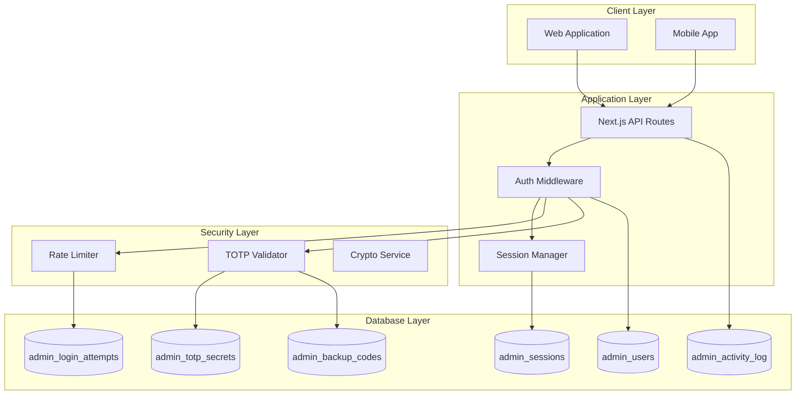
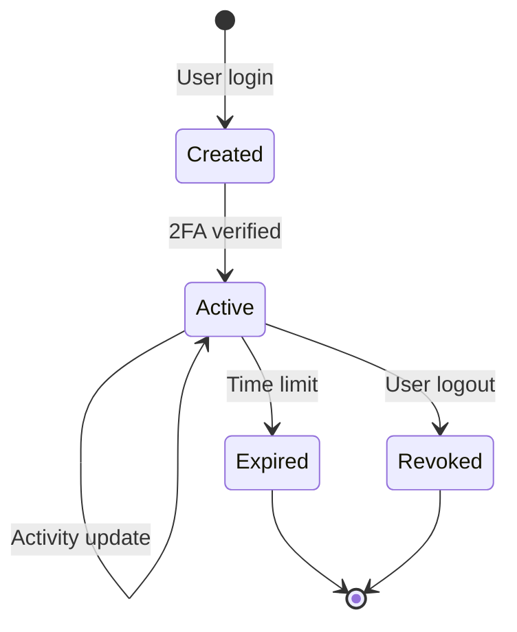
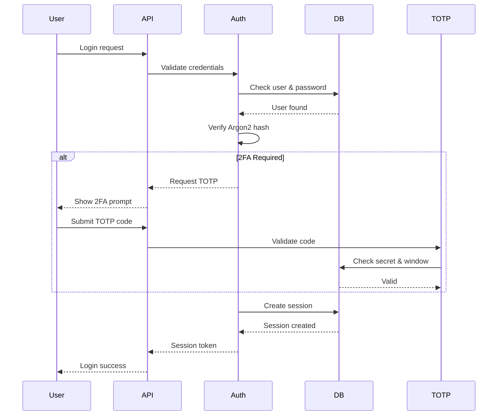

# Authentication Database Architecture
## The Backroom Leeds - Secure Admin Authentication System

### Version 1.0.0 | Date: 2025-08-26

---

## Table of Contents

1. [Executive Summary](#executive-summary)
2. [Architecture Overview](#architecture-overview)
3. [Database Schema Design](#database-schema-design)
4. [Security Features](#security-features)
5. [Role-Based Access Control](#role-based-access-control)
6. [Session Management](#session-management)
7. [Two-Factor Authentication](#two-factor-authentication)
8. [Rate Limiting & Security Monitoring](#rate-limiting--security-monitoring)
9. [Audit Logging & Compliance](#audit-logging--compliance)
10. [Performance Optimization](#performance-optimization)
11. [Maintenance & Operations](#maintenance--operations)
12. [Implementation Guidelines](#implementation-guidelines)
13. [Testing Strategy](#testing-strategy)
14. [Migration Path](#migration-path)

---

## Executive Summary

The Backroom Leeds authentication system implements a comprehensive, production-ready security infrastructure designed to protect admin access to the venue management platform. This architecture provides:

- **Three-tier role hierarchy** with enforced limits (1 super admin, 10 managers, 10 door staff)
- **TOTP-based 2FA** with encrypted secret storage and backup codes
- **Secure session management** with automatic expiry and device tracking
- **Advanced rate limiting** to prevent brute force attacks
- **Comprehensive audit logging** for compliance and security monitoring
- **Row-level security** policies for data isolation
- **Password security** using Argon2id hashing with history tracking

### Key Security Features

✅ **Argon2id password hashing** - Winner of Password Hashing Competition  
✅ **Encrypted TOTP secrets** - AES-256-GCM encryption at rest  
✅ **Rate limiting** - Progressive delays and account lockout  
✅ **Session management** - 8-hour sessions with activity tracking  
✅ **Audit trail** - Complete activity logging for compliance  
✅ **RLS policies** - Database-level access control  
✅ **Backup codes** - 10 single-use recovery codes per user  
✅ **Password policies** - Complexity requirements and history tracking

---

## Architecture Overview

### System Components



### Technology Stack

| Component | Technology | Purpose |
|-----------|------------|---------|
| **Database** | PostgreSQL 15+ | Primary data store |
| **ORM** | Supabase Client | Database abstraction |
| **Password Hashing** | Argon2id | Secure password storage |
| **Encryption** | AES-256-GCM | TOTP secret encryption |
| **2FA** | TOTP (RFC 6238) | Time-based authentication |
| **Session Store** | PostgreSQL | Session persistence |
| **Rate Limiting** | Database-backed | Brute force protection |

---

## Database Schema Design

### Core Tables

#### 1. **admin_users**
Primary authentication table storing user credentials and metadata.

```sql
admin_users
├── id (UUID, PK)
├── email (CITEXT, UNIQUE)
├── username (VARCHAR(50), UNIQUE)
├── full_name (VARCHAR(255))
├── password_hash (VARCHAR(255))
├── role (admin_role ENUM)
├── totp_enabled (BOOLEAN)
├── is_active (BOOLEAN)
├── failed_login_attempts (INTEGER)
├── locked_until (TIMESTAMPTZ)
└── [metadata fields...]
```

**Key Features:**
- Case-insensitive email storage using CITEXT
- Argon2id password hashing
- Account lockout after failed attempts
- Soft delete support with `deleted_at`
- Password expiry tracking

#### 2. **admin_sessions**
Active session management with security tracking.

```sql
admin_sessions
├── id (UUID, PK)
├── session_token (VARCHAR(255), UNIQUE)
├── user_id (UUID, FK → admin_users)
├── status (session_status ENUM)
├── totp_verified (BOOLEAN)
├── ip_address (INET)
├── expires_at (TIMESTAMPTZ)
└── [tracking fields...]
```

**Key Features:**
- Secure random token generation
- IP address tracking
- Device fingerprinting support
- Automatic expiry handling
- Revocation tracking

#### 3. **admin_totp_secrets**
Encrypted storage for TOTP configuration.

```sql
admin_totp_secrets
├── id (UUID, PK)
├── user_id (UUID, UNIQUE, FK → admin_users)
├── encrypted_secret (TEXT)
├── encryption_iv (VARCHAR(32))
├── issuer (VARCHAR(100))
├── verified (BOOLEAN)
└── [configuration fields...]
```

**Security Implementation:**
- AES-256-GCM encryption
- Unique IV per secret
- Replay attack prevention
- Verification status tracking

#### 4. **admin_backup_codes**
Single-use recovery codes for 2FA bypass.

```sql
admin_backup_codes
├── id (UUID, PK)
├── user_id (UUID, FK → admin_users)
├── code_hash (VARCHAR(255))
├── used (BOOLEAN)
├── used_at (TIMESTAMPTZ)
└── expires_at (TIMESTAMPTZ)
```

**Features:**
- Hashed storage (not plaintext)
- Single-use enforcement
- Expiry after 1 year
- Usage tracking

#### 5. **admin_login_attempts**
Rate limiting and security monitoring.

```sql
admin_login_attempts
├── id (UUID, PK)
├── email (CITEXT)
├── ip_address (INET)
├── result (login_attempt_result ENUM)
├── suspicious_indicators (JSONB)
└── attempted_at (TIMESTAMPTZ)
```

**Security Monitoring:**
- IP-based rate limiting
- Email-based rate limiting
- Suspicious activity detection
- VPN/Tor detection support

#### 6. **admin_activity_log**
Comprehensive audit trail for compliance.

```sql
admin_activity_log
├── id (UUID, PK)
├── user_id (UUID, FK → admin_users)
├── action (activity_action ENUM)
├── entity_type (VARCHAR(50))
├── entity_id (VARCHAR(255))
├── old_values (JSONB)
├── new_values (JSONB)
└── created_at (TIMESTAMPTZ)
```

**Compliance Features:**
- Immutable audit trail
- Change tracking
- User action attribution
- Metadata storage

---

## Security Features

### Password Security

#### Argon2id Configuration

```sql
-- Recommended parameters for production
ARGON2_OPTIONS = {
    type: argon2id,          -- Hybrid mode (best of both worlds)
    memoryCost: 65536,       -- 64 MB memory usage
    timeCost: 3,             -- 3 iterations
    parallelism: 1,          -- Single thread
    hashLength: 32,          -- 256-bit output
    saltLength: 16           -- 128-bit salt
}
```

**Security Benefits:**
- **Memory-hard function**: Resistant to GPU/ASIC attacks
- **Side-channel resistant**: Argon2id variant
- **Configurable difficulty**: Adjust based on server capacity
- **Industry standard**: Winner of Password Hashing Competition

#### Password Complexity Requirements

```sql
-- Enforced by validate_password_complexity() function
- Minimum 8 characters
- At least 1 uppercase letter (A-Z)
- At least 1 lowercase letter (a-z)
- At least 1 number (0-9)
- At least 1 special character (!@#$%^&*()_+-=[]{};':"\\|,.<>/?)
```

#### Password History

- Prevents reuse of last 12 passwords
- Automatic tracking in `admin_password_history` table
- Enforced at database level

### Encryption Implementation

#### TOTP Secret Encryption

```typescript
// Encryption process (application layer)
const encryptTOTPSecret = (secret: string): EncryptedData => {
    const iv = crypto.randomBytes(16);
    const cipher = crypto.createCipheriv('aes-256-gcm', ENCRYPTION_KEY, iv);
    
    let encrypted = cipher.update(secret, 'utf8', 'hex');
    encrypted += cipher.final('hex');
    
    const authTag = cipher.getAuthTag();
    
    return {
        encrypted: encrypted + authTag.toString('hex'),
        iv: iv.toString('hex')
    };
};
```

**Security Measures:**
- AES-256-GCM authenticated encryption
- Unique IV per encryption
- Authentication tag verification
- Key rotation support

### Session Security

#### Session Lifecycle



**Session Parameters:**
- **Default duration**: 8 hours
- **Remember me duration**: 30 days
- **Inactivity timeout**: 30 minutes
- **Max concurrent sessions**: 3 per user

---

## Role-Based Access Control

### Role Hierarchy

```typescript
enum AdminRole {
    SUPER_ADMIN = 'super_admin',  // Full system access
    MANAGER = 'manager',          // Booking & event management
    DOOR_STAFF = 'door_staff'     // Check-in operations only
}
```

### Permission Matrix

| Permission | Super Admin | Manager | Door Staff |
|------------|:-----------:|:-------:|:----------:|
| **Users** |
| users:read | ✅ | ❌ | ❌ |
| users:create | ✅ | ❌ | ❌ |
| users:update | ✅ | ❌ | ❌ |
| users:delete | ✅ | ❌ | ❌ |
| **Bookings** |
| bookings:read | ✅ | ✅ | ✅ |
| bookings:create | ✅ | ✅ | ❌ |
| bookings:update | ✅ | ✅ | ❌ |
| bookings:delete | ✅ | ✅ | ❌ |
| bookings:checkin | ✅ | ✅ | ✅ |
| **Events** |
| events:read | ✅ | ✅ | ❌ |
| events:manage | ✅ | ✅ | ❌ |
| **Reports** |
| reports:read | ✅ | ✅ | ❌ |
| reports:export | ✅ | ✅ | ❌ |
| **System** |
| system:manage | ✅ | ❌ | ❌ |
| system:view_logs | ✅ | ❌ | ❌ |

### Role Enforcement

```sql
-- Database-level enforcement
CREATE OR REPLACE FUNCTION enforce_role_limits()
RETURNS TRIGGER AS $$
BEGIN
    -- Enforce maximum counts
    IF NEW.role = 'super_admin' AND 
       (SELECT COUNT(*) FROM admin_users WHERE role = 'super_admin') >= 1 THEN
        RAISE EXCEPTION 'Maximum super admins (1) reached';
    END IF;
    -- Similar checks for other roles...
END;
$$ LANGUAGE plpgsql;
```

---

## Session Management

### Session Creation Flow



### Session Storage Schema

```sql
-- Session data structure
{
    id: UUID,
    session_token: VARCHAR(255),  -- Secure random token
    user_id: UUID,
    status: 'active' | 'expired' | 'revoked',
    totp_verified: BOOLEAN,
    ip_address: INET,
    user_agent: TEXT,
    device_fingerprint: {
        browser: STRING,
        os: STRING,
        screen: STRING,
        timezone: STRING
    },
    created_at: TIMESTAMPTZ,
    expires_at: TIMESTAMPTZ,
    last_activity_at: TIMESTAMPTZ
}
```

---

## Two-Factor Authentication

### TOTP Implementation

#### Configuration

```typescript
const TOTP_CONFIG = {
    issuer: 'The Backroom Leeds',
    algorithm: 'SHA1',      // RFC standard
    digits: 6,              // 6-digit codes
    period: 30,             // 30-second windows
    window: 1,              // Allow ±1 period
    skew: 0                 // No time skew
};
```

#### Setup Flow

1. **Secret Generation**
   ```typescript
   const secret = generateSecret({
       length: 32,         // 256 bits
       name: user.email,
       issuer: 'The Backroom Leeds'
   });
   ```

2. **QR Code Generation**
   ```typescript
   const otpauth = secret.otpauth_url;
   const qrCode = await QRCode.toDataURL(otpauth);
   ```

3. **Verification**
   ```typescript
   const verified = verifyToken(
       userInput,
       decryptedSecret,
       { window: 1 }
   );
   ```

### Backup Codes

#### Generation

```sql
-- Generate 10 backup codes
FOR i IN 1..10 LOOP
    code := generate_secure_random(8);  -- 8 characters
    hash := hash_backup_code(code);
    INSERT INTO admin_backup_codes (user_id, code_hash) 
    VALUES (user_id, hash);
    codes_array := array_append(codes_array, code);
END LOOP;
```

#### Usage

- Single-use only
- Automatically marked as used
- Expire after 1 year
- Rate limited (max 3 attempts per code)

---

## Rate Limiting & Security Monitoring

### Rate Limiting Strategy

```sql
-- Rate limit configuration
RATE_LIMITS = {
    login_attempts: {
        max_attempts: 10,        -- Per 15 minutes
        max_failures: 5,         -- Before lockout
        window: '15 minutes',
        lockout_duration: '30 minutes'
    },
    api_requests: {
        authenticated: 1000,     -- Per hour
        unauthenticated: 100,    -- Per hour
        window: '1 hour'
    },
    password_reset: {
        max_attempts: 3,         -- Per day
        window: '24 hours'
    }
}
```

### Implementation

```sql
CREATE OR REPLACE FUNCTION check_login_rate_limit(
    p_email CITEXT,
    p_ip_address INET
) RETURNS BOOLEAN AS $$
DECLARE
    recent_attempts INTEGER;
    recent_failures INTEGER;
BEGIN
    -- Check by email
    SELECT COUNT(*) INTO recent_attempts
    FROM admin_login_attempts
    WHERE email = p_email
        AND attempted_at > NOW() - INTERVAL '15 minutes';
    
    -- Check by IP
    SELECT COUNT(*) INTO recent_failures
    FROM admin_login_attempts
    WHERE ip_address = p_ip_address
        AND result != 'success'
        AND attempted_at > NOW() - INTERVAL '15 minutes';
    
    -- Apply limits
    IF recent_attempts >= 10 OR recent_failures >= 5 THEN
        -- Log security event
        INSERT INTO admin_activity_log (action, metadata)
        VALUES ('rate_limit_exceeded', jsonb_build_object(
            'email', p_email,
            'ip', p_ip_address::TEXT
        ));
        
        RETURN FALSE;
    END IF;
    
    RETURN TRUE;
END;
$$ LANGUAGE plpgsql;
```

### Suspicious Activity Detection

```sql
-- Indicators tracked
suspicious_indicators = {
    vpn: BOOLEAN,           -- VPN detection
    tor: BOOLEAN,           -- Tor exit node
    country: STRING,        -- Geolocation
    risk_score: INTEGER,    -- 0-100 risk assessment
    user_agent_mismatch: BOOLEAN,
    rapid_ip_changes: BOOLEAN,
    impossible_travel: BOOLEAN
}
```

---

## Audit Logging & Compliance

### Logged Events

All security-relevant events are logged:

- **Authentication Events**: Login, logout, failed attempts
- **Authorization Events**: Permission checks, role changes
- **Data Access**: Sensitive data views, exports
- **Modifications**: User changes, booking updates
- **Security Events**: Password changes, 2FA setup, lockouts

### Log Structure

```sql
-- Comprehensive audit entry
{
    id: UUID,
    user_id: UUID,
    user_email: STRING,
    user_role: ENUM,
    action: ENUM,
    entity_type: STRING,
    entity_id: STRING,
    old_values: JSONB,      -- Previous state
    new_values: JSONB,      -- New state
    metadata: JSONB,        -- Additional context
    ip_address: INET,
    user_agent: TEXT,
    session_id: UUID,
    created_at: TIMESTAMPTZ
}
```

### Compliance Features

✅ **Immutability**: Logs cannot be modified or deleted  
✅ **Completeness**: All actions are logged  
✅ **Attribution**: Every action tied to a user  
✅ **Retention**: Configurable retention periods  
✅ **Export**: Support for compliance reporting  

### GDPR Compliance

```sql
-- Data retention policies
CREATE OR REPLACE FUNCTION cleanup_old_data()
RETURNS VOID AS $$
BEGIN
    -- Remove login attempts older than 90 days
    DELETE FROM admin_login_attempts 
    WHERE attempted_at < NOW() - INTERVAL '90 days';
    
    -- Archive activity logs older than 2 years
    INSERT INTO admin_activity_log_archive
    SELECT * FROM admin_activity_log
    WHERE created_at < NOW() - INTERVAL '2 years';
    
    -- Anonymize deleted user data
    UPDATE admin_users
    SET email = 'deleted_' || id || '@removed.com',
        full_name = 'Deleted User',
        username = 'deleted_' || substring(id::TEXT, 1, 8)
    WHERE deleted_at < NOW() - INTERVAL '30 days';
END;
$$ LANGUAGE plpgsql;
```

---

## Performance Optimization

### Indexing Strategy

```sql
-- Primary indexes for authentication
CREATE INDEX idx_admin_users_email ON admin_users(email) 
    WHERE deleted_at IS NULL;
CREATE INDEX idx_admin_users_role ON admin_users(role) 
    WHERE is_active = TRUE;

-- Session management
CREATE INDEX idx_sessions_token ON admin_sessions(session_token) 
    WHERE status = 'active';
CREATE INDEX idx_sessions_expires ON admin_sessions(expires_at) 
    WHERE status = 'active';

-- Rate limiting
CREATE INDEX idx_login_attempts_email ON admin_login_attempts(email, attempted_at DESC);
CREATE INDEX idx_login_attempts_ip ON admin_login_attempts(ip_address, attempted_at DESC);
CREATE INDEX idx_login_attempts_recent ON admin_login_attempts(attempted_at) 
    WHERE attempted_at > NOW() - INTERVAL '1 hour';

-- Audit logging
CREATE INDEX idx_activity_log_user ON admin_activity_log(user_id, created_at DESC);
CREATE INDEX idx_activity_log_action ON admin_activity_log(action, created_at DESC);
CREATE INDEX idx_activity_log_entity ON admin_activity_log(entity_type, entity_id);
```

### Query Optimization

```sql
-- Optimized session validation
CREATE OR REPLACE FUNCTION validate_session(p_token VARCHAR)
RETURNS TABLE(user_id UUID, role admin_role, permissions TEXT[])
AS $$
BEGIN
    RETURN QUERY
    SELECT 
        s.user_id,
        u.role,
        CASE u.role
            WHEN 'super_admin' THEN ARRAY['*']
            WHEN 'manager' THEN ARRAY['bookings:*', 'events:*', 'reports:read']
            WHEN 'door_staff' THEN ARRAY['bookings:read', 'bookings:checkin']
        END as permissions
    FROM admin_sessions s
    JOIN admin_users u ON u.id = s.user_id
    WHERE s.session_token = p_token
        AND s.status = 'active'
        AND s.expires_at > NOW()
        AND u.is_active = TRUE
        AND u.deleted_at IS NULL;
END;
$$ LANGUAGE plpgsql;
```

### Connection Pooling

```typescript
// Recommended Supabase configuration
const supabase = createClient(url, key, {
    auth: {
        persistSession: true,
        autoRefreshToken: true
    },
    db: {
        schema: 'public'
    },
    global: {
        headers: {
            'x-connection-pool': 'auth'
        }
    }
});
```

---

## Maintenance & Operations

### Scheduled Tasks

```sql
-- Daily maintenance (run at 3 AM)
SELECT perform_authentication_maintenance();

-- Functions performed:
- Clean expired sessions
- Remove old login attempts (>30 days)
- Delete expired backup codes
- Unlock accounts past lock period
- Mark passwords for renewal
- Archive old audit logs
```

### Monitoring Queries

```sql
-- Active users by role
SELECT role, COUNT(*) as count
FROM admin_users
WHERE is_active = TRUE AND deleted_at IS NULL
GROUP BY role;

-- Failed login attempts (last hour)
SELECT 
    email,
    COUNT(*) as attempts,
    MAX(attempted_at) as last_attempt
FROM admin_login_attempts
WHERE result != 'success'
    AND attempted_at > NOW() - INTERVAL '1 hour'
GROUP BY email
ORDER BY attempts DESC;

-- Session statistics
SELECT 
    COUNT(*) FILTER (WHERE status = 'active') as active_sessions,
    COUNT(*) FILTER (WHERE status = 'expired') as expired_sessions,
    COUNT(*) FILTER (WHERE totp_verified = TRUE) as verified_sessions
FROM admin_sessions
WHERE created_at > NOW() - INTERVAL '24 hours';
```

### Backup Strategy

```bash
# Daily backup of authentication tables
pg_dump -h localhost -U postgres -d backroom_leeds \
    -t admin_users \
    -t admin_sessions \
    -t admin_totp_secrets \
    -t admin_backup_codes \
    -t admin_activity_log \
    -f auth_backup_$(date +%Y%m%d).sql

# Encrypted backup storage
gpg --encrypt --recipient backup@backroomleeds.com auth_backup_*.sql
aws s3 cp auth_backup_*.sql.gpg s3://backroom-backups/auth/
```

---

## Implementation Guidelines

### Phase 1: Core Setup (Week 1)

1. **Database Migration**
   ```bash
   supabase migration new authentication_system
   # Copy schema from 20250826_authentication_system_complete.sql
   supabase db push
   ```

2. **Environment Configuration**
   ```env
   # .env.local
   TOTP_ENCRYPTION_KEY=<32-byte-hex-key>
   ARGON2_MEMORY_COST=65536
   ARGON2_TIME_COST=3
   SESSION_SECRET=<random-64-byte-string>
   ```

3. **Initial Admin Setup**
   ```sql
   -- Change default password immediately
   UPDATE admin_users 
   SET password_hash = <new-argon2-hash>
   WHERE email = 'admin@backroomleeds.com';
   ```

### Phase 2: Application Integration (Week 2)

1. **Auth Middleware**
   ```typescript
   // middleware/auth.ts
   export async function validateSession(token: string) {
       const session = await supabase
           .from('admin_sessions')
           .select('*, user:admin_users(*)')
           .eq('session_token', token)
           .eq('status', 'active')
           .single();
       
       if (!session.data) throw new UnauthorizedError();
       
       // Update last activity
       await updateSessionActivity(session.data.id);
       
       return session.data;
   }
   ```

2. **Permission Guards**
   ```typescript
   // guards/permission.ts
   export function requirePermission(permission: Permission) {
       return async (req: NextRequest) => {
           const session = await getSession(req);
           const hasPermission = userHasPermission(
               session.user.role,
               permission
           );
           
           if (!hasPermission) {
               throw new ForbiddenError();
           }
       };
   }
   ```

### Phase 3: 2FA Implementation (Week 3)

1. **TOTP Setup Endpoint**
   ```typescript
   // api/auth/2fa/setup
   export async function POST(req: NextRequest) {
       const session = await requireAuth(req);
       
       // Generate secret
       const secret = authenticator.generateSecret();
       
       // Encrypt and store
       const encrypted = encryptTOTPSecret(secret);
       await supabase
           .from('admin_totp_secrets')
           .insert({
               user_id: session.user.id,
               encrypted_secret: encrypted.secret,
               encryption_iv: encrypted.iv
           });
       
       // Generate QR code
       const qrCode = await generateQRCode(secret, session.user.email);
       
       // Generate backup codes
       const backupCodes = await generateBackupCodes(session.user.id);
       
       return NextResponse.json({
           qrCode,
           backupCodes
       });
   }
   ```

---

## Testing Strategy

### Unit Tests

```typescript
// tests/auth/password.test.ts
describe('Password Security', () => {
    test('should hash password with Argon2id', async () => {
        const password = 'TestPass123!';
        const hash = await hashPassword(password);
        
        expect(hash).toMatch(/^\$argon2id\$/);
        expect(await verifyPassword(hash, password)).toBe(true);
        expect(await verifyPassword(hash, 'wrong')).toBe(false);
    });
    
    test('should enforce complexity requirements', () => {
        expect(validatePasswordComplexity('weak')).toBe(false);
        expect(validatePasswordComplexity('NoNumber!')).toBe(false);
        expect(validatePasswordComplexity('ValidPass123!')).toBe(true);
    });
});
```

### Integration Tests

```typescript
// tests/auth/session.test.ts
describe('Session Management', () => {
    test('should create session after successful login', async () => {
        const response = await request(app)
            .post('/api/auth/login')
            .send({
                email: 'test@backroomleeds.com',
                password: 'TestPass123!'
            });
        
        expect(response.status).toBe(200);
        expect(response.body.session).toBeDefined();
        expect(response.body.session.expires_at).toBeDefined();
    });
    
    test('should enforce rate limiting', async () => {
        // Make 5 failed attempts
        for (let i = 0; i < 5; i++) {
            await request(app)
                .post('/api/auth/login')
                .send({
                    email: 'test@backroomleeds.com',
                    password: 'wrong'
                });
        }
        
        // 6th attempt should be rate limited
        const response = await request(app)
            .post('/api/auth/login')
            .send({
                email: 'test@backroomleeds.com',
                password: 'TestPass123!'
            });
        
        expect(response.status).toBe(429);
        expect(response.body.error).toContain('rate limit');
    });
});
```

### Security Tests

```typescript
// tests/security/injection.test.ts
describe('SQL Injection Prevention', () => {
    test('should prevent SQL injection in login', async () => {
        const maliciousEmail = "admin'; DROP TABLE admin_users; --";
        
        const response = await request(app)
            .post('/api/auth/login')
            .send({
                email: maliciousEmail,
                password: 'password'
            });
        
        expect(response.status).toBe(400);
        
        // Verify table still exists
        const tableExists = await checkTableExists('admin_users');
        expect(tableExists).toBe(true);
    });
});
```

---

## Migration Path

### From Existing System

```sql
-- Migration script for existing users
BEGIN;

-- 1. Create new tables
-- Run: 20250826_authentication_system_complete.sql

-- 2. Migrate existing users
INSERT INTO admin_users (
    email,
    username,
    full_name,
    password_hash,
    role,
    created_at
)
SELECT 
    email,
    LOWER(REPLACE(name, ' ', '')),
    name,
    -- Rehash passwords on next login
    '$argon2id$MIGRATION_REQUIRED',
    CASE 
        WHEN is_admin THEN 'manager'
        ELSE 'door_staff'
    END,
    created_at
FROM old_users_table;

-- 3. Set migration flag
UPDATE admin_users 
SET must_change_password = TRUE
WHERE password_hash = '$argon2id$MIGRATION_REQUIRED';

-- 4. Create audit log entry
INSERT INTO admin_activity_log (
    action,
    metadata,
    created_at
)
VALUES (
    'system_migration',
    jsonb_build_object(
        'migrated_users', (SELECT COUNT(*) FROM admin_users),
        'migration_date', NOW()
    ),
    NOW()
);

COMMIT;
```

### Rollback Plan

```sql
-- Rollback script (keep for 30 days post-migration)
BEGIN;

-- 1. Backup current data
CREATE TABLE admin_users_backup AS SELECT * FROM admin_users;
CREATE TABLE admin_sessions_backup AS SELECT * FROM admin_sessions;

-- 2. Restore original schema
DROP TABLE IF EXISTS admin_users CASCADE;
-- Restore original table structure...

-- 3. Migrate data back
INSERT INTO original_users_table
SELECT ... FROM admin_users_backup;

COMMIT;
```

---

## Appendix

### A. Environment Variables

```bash
# Required environment variables
TOTP_ENCRYPTION_KEY=          # 32-byte hex key for TOTP encryption
SESSION_SECRET=                # Random 64-byte string for sessions
ARGON2_MEMORY_COST=65536      # Memory parameter for Argon2
ARGON2_TIME_COST=3            # Time parameter for Argon2
ARGON2_PARALLELISM=1          # Parallelism for Argon2
RATE_LIMIT_WINDOW=900         # Rate limit window in seconds
RATE_LIMIT_MAX_ATTEMPTS=10    # Max attempts per window
SESSION_DURATION=28800         # Session duration in seconds (8 hours)
PASSWORD_MIN_LENGTH=8          # Minimum password length
PASSWORD_HISTORY_COUNT=12      # Number of old passwords to track
AUDIT_LOG_RETENTION_DAYS=730  # Audit log retention period
```

### B. SQL Functions Reference

| Function | Purpose | Parameters | Returns |
|----------|---------|------------|---------|
| `enforce_role_limits()` | Enforce max users per role | - | TRIGGER |
| `check_login_rate_limit()` | Check rate limiting | email, ip | BOOLEAN |
| `validate_password_complexity()` | Validate password | password | BOOLEAN |
| `check_password_history()` | Check password reuse | user_id, hash | BOOLEAN |
| `cleanup_expired_sessions()` | Clean expired sessions | - | INTEGER |
| `user_has_permission()` | Check permission | user_id, permission | BOOLEAN |
| `log_admin_activity()` | Log activity | multiple | UUID |

### C. Security Checklist

- [ ] Change default super admin password
- [ ] Generate unique TOTP encryption key
- [ ] Configure environment variables
- [ ] Enable SSL/TLS for database connections
- [ ] Set up database backups
- [ ] Configure monitoring alerts
- [ ] Test rate limiting
- [ ] Verify 2FA flow
- [ ] Test password complexity
- [ ] Validate RLS policies
- [ ] Review audit logs
- [ ] Document emergency procedures
- [ ] Train staff on security procedures
- [ ] Schedule security audits

---

## Contact & Support

**Technical Lead**: Development Team  
**Security Contact**: security@backroomleeds.com  
**Documentation**: [Internal Wiki]  
**Issue Tracking**: [GitHub Issues]  

---

*This document is classified as CONFIDENTIAL and should not be shared outside the development team.*