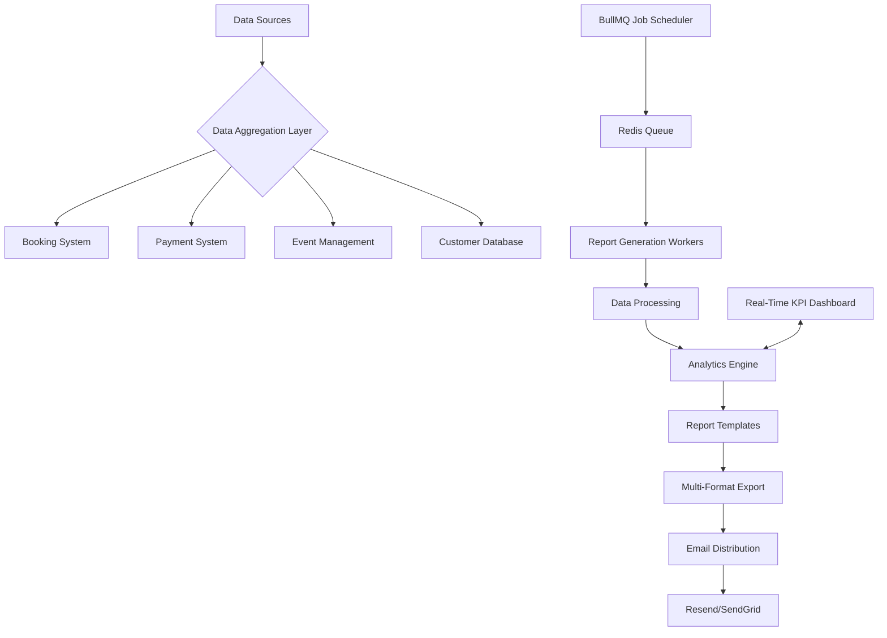

# Automated Reporting System - Technical Architecture

## System Overview
The Backroom Leeds Automated Reporting System is a sophisticated, scalable solution for comprehensive venue performance analytics, designed with enterprise-grade architectural principles.

## Technical Architecture Diagram


## Core Components

### 1. Data Aggregation Layer
- **Sources**:
  - Booking System
  - Payment Transactions
  - Event Management
  - Customer Profiles
- **Capabilities**:
  - Real-time data collection
  - Cross-system data normalization
  - GDPR-compliant data handling

### 2. Job Scheduling Architecture
- **Technology**: BullMQ with Redis
- **Features**:
  - Cron-based scheduling
  - Precise timezone management (Europe/London)
  - Job dependency management
  - Exponential backoff retry logic

#### Scheduling Configuration Example
```typescript
const dailyReportJob = new Queue('daily-reports', {
  redis: { host: 'redis.backroom-leeds.internal' },
  settings: {
    lockDuration: 30000, // 30 seconds
    stalledInterval: 60000, // 1 minute
  }
});

dailyReportJob.add('generate-report', reportData, {
  repeat: {
    cron: '0 22 * * *', // 10 PM daily
    tz: 'Europe/London'
  },
  attempts: 3,
  backoff: {
    type: 'exponential',
    delay: 1000
  }
});
```

### 3. Report Generation Pipeline
- **Processing Stages**:
  1. Data Aggregation
  2. Transformation
  3. Analytics Calculation
  4. Template Rendering
  5. Multi-Format Export

- **Report Types**:
  - Daily Operational Report
  - Weekly Strategic Analytics
  - Event Performance Summary
  - Customer Behavior Insights

### 4. Email Distribution System
- **Primary Provider**: Resend
- **Fallback Provider**: SendGrid
- **Features**:
  - Multi-provider failover
  - Professional React Email templates
  - Delivery tracking
  - Compliance logging

#### Email Template Example
```typescript
import { Html } from 'react-email';

const BackroomReportEmail = ({ reportData }) => (
  <Html>
    <Head>
      <title>Backroom Leeds - Daily Performance Report</title>
    </Head>
    <Body>
      <Container>
        <Section>
          <Heading>Daily Venue Performance</Heading>
          <Text>Bookings: {reportData.bookings}</Text>
          <Text>Revenue: £{reportData.revenue}</Text>
        </Section>
      </Container>
    </Body>
  </Html>
);
```

### 5. Real-Time KPI Dashboard
- **Real-time Performance Metrics**
  - Current Venue Occupancy
  - Active Bookings
  - Hourly Revenue
  - Event Performance

## Performance Optimization
- **Caching Strategy**:
  - Redis for job queue management
  - Materialized database views
  - Efficient data aggregation queries

## Compliance and Security
- **Data Handling**:
  - GDPR-compliant anonymization
  - Role-based data access
  - Comprehensive audit logging

## Scalability Considerations
- Horizontally scalable worker architecture
- Configurable report generation complexity
- Extensible plugin system for new report types

## Environment Configuration
```bash
# .env.production
REDIS_URL=redis://queue.backroom-leeds.internal
RESEND_API_KEY=your_resend_api_key
SENDGRID_API_KEY=your_sendgrid_api_key
REPORT_RECIPIENT_EMAILS=management@backroom-leeds.com
```

## Monitoring and Observability
- Prometheus metrics integration
- Grafana dashboard for system health
- Automated alerting for job failures

## Future Roadmap
- Machine learning predictive analytics
- Enhanced customer segmentation
- Multi-venue reporting capabilities
