# Email Notification System Architecture
## The Backroom Leeds - Phase 3, Step 3.6

### Version: 1.0.0
### Date: 2025-08-26
### Status: Production-Ready Architecture

---

## 1. Executive Summary

The Email Notification System provides comprehensive customer communication capabilities for The Backroom Leeds, integrating with existing booking, payment, and queue management systems. This architecture ensures reliable, scalable, and GDPR-compliant email delivery while maintaining the venue's sophisticated prohibition-era brand identity.

### Key Features
- Multi-provider email service with automatic failover
- React Email templates with prohibition-themed styling
- BullMQ-powered queue management with retry logic
- GDPR-compliant tracking and analytics
- Customer preference management system
- Real-time monitoring and alerting

### Volume Requirements
- **Expected Load**: 200-500 bookings per week
- **Monthly Emails**: 5,300+ transactional and marketing emails
- **Peak Processing**: 10,000+ emails during busy periods
- **Delivery SLA**: Sub-minute for critical confirmations

---

## 2. System Architecture

### 2.1 High-Level Architecture

```mermaid
graph TB
    subgraph "Email Service Layer"
        ESP[Email Service Provider Manager]
        RES[Resend - Primary]
        POS[Postmark - Backup]
        SES[AWS SES - Bulk]
    end
    
    subgraph "Application Layer"
        API[Email API]
        TPL[Template Engine]
        QM[Queue Manager]
        TRK[Tracking System]
    end
    
    subgraph "Data Layer"
        DB[(PostgreSQL)]
        RDS[(Redis)]
        S3[(S3 Storage)]
    end
    
    subgraph "External Systems"
        BK[Booking System]
        PAY[Payment System]
        QR[QR Code System]
        RPT[Reporting System]
    end
    
    BK --> API
    PAY --> API
    QR --> TPL
    API --> QM
    QM --> ESP
    ESP --> RES
    ESP --> POS
    ESP --> SES
    TPL --> API
    TRK --> DB
    QM --> RDS
    TPL --> S3
    RPT --> TRK
```



### 2.2 Component Architecture

#### 2.2.1 Email Service Provider Manager
```typescript
interface EmailServiceProvider {
  name: 'resend' | 'postmark' | 'ses';
  priority: number;
  isHealthy: boolean;
  sendEmail: (email: EmailMessage) => Promise<EmailResult>;
  checkHealth: () => Promise<boolean>;
  getQuota: () => Promise<QuotaInfo>;
}

class EmailServiceManager {
  private providers: Map<string, EmailServiceProvider>;
  private healthMonitor: HealthMonitor;
  
  async sendWithFailover(email: EmailMessage): Promise<EmailResult> {
    const providers = this.getHealthyProviders();
    
    for (const provider of providers) {
      try {
        return await provider.sendEmail(email);
      } catch (error) {
        await this.handleProviderError(provider, error);
        continue;
      }
    }
    
    throw new AllProvidersFailedError();
  }
}
```

#### 2.2.2 Template System Architecture
```typescript
interface EmailTemplate {
  id: string;
  name: string;
  version: string;
  subject: string;
  component: React.ComponentType<any>;
  variables: TemplateVariable[];
  testData: Record<string, any>;
  analytics: TemplateAnalytics;
}

class TemplateEngine {
  private templates: Map<string, EmailTemplate>;
  private renderer: ReactEmailRenderer;
  
  async renderTemplate(
    templateId: string,
    data: Record<string, any>,
    options: RenderOptions
  ): Promise<RenderedEmail> {
    const template = this.getTemplate(templateId);
    const html = await this.renderer.render(template.component, data);
    const text = await this.generatePlainText(html);
    
    return {
      html: this.injectTracking(html, options),
      text,
      subject: this.interpolateSubject(template.subject, data)
    };
  }
}
```

#### 2.2.3 Queue Management System
```typescript
interface EmailJob {
  id: string;
  type: EmailType;
  priority: Priority;
  template: string;
  recipient: EmailRecipient;
  data: Record<string, any>;
  attempts: number;
  maxAttempts: number;
  scheduledAt?: Date;
  metadata: JobMetadata;
}

class EmailQueueManager {
  private queues: Map<Priority, Queue>;
  private deadLetterQueue: Queue;
  
  async addToQueue(job: EmailJob): Promise<string> {
    const queue = this.getQueueByPriority(job.priority);
    
    return await queue.add(job.type, job, {
      delay: job.scheduledAt ? job.scheduledAt.getTime() - Date.now() : 0,
      attempts: job.maxAttempts,
      backoff: {
        type: 'exponential',
        delay: 2000
      },
      removeOnComplete: {
        age: 3600, // 1 hour
        count: 100
      },
      removeOnFail: false
    });
  }
}
```

### 2.3 Integration Architecture

#### 2.3.1 Booking System Integration
```typescript
// Event-driven email triggers
bookingEvents.on('booking.confirmed', async (booking) => {
  await emailService.sendBookingConfirmation({
    booking,
    qrCode: await qrService.generateBookingQR(booking.id),
    includePackageDetails: true
  });
});

bookingEvents.on('booking.cancelled', async (booking) => {
  await emailService.sendCancellationConfirmation({
    booking,
    refundEligible: booking.isRefundEligible(),
    refundAmount: booking.calculateRefund()
  });
});
```

#### 2.3.2 Payment System Integration
```typescript
// Stripe webhook handlers
stripeWebhooks.on('payment_intent.succeeded', async (paymentIntent) => {
  await emailService.sendPaymentConfirmation({
    paymentIntent,
    booking: await bookingService.findByPaymentIntent(paymentIntent.id)
  });
});

stripeWebhooks.on('refund.created', async (refund) => {
  await emailService.sendRefundProcessed({
    refund,
    booking: await bookingService.findByPaymentIntent(refund.payment_intent)
  });
});
```

#### 2.3.3 Waitlist System Integration
```typescript
// Real-time waitlist notifications
waitlistEvents.on('slot.available', async (waitlistEntry) => {
  await emailService.sendWaitlistNotification({
    entry: waitlistEntry,
    expiresAt: new Date(Date.now() + 30 * 60 * 1000), // 30 minutes
    bookingLink: generateSecureBookingLink(waitlistEntry)
  });
});
```

---

## 3. Email Templates Architecture

### 3.1 Template Component Structure

```typescript
// Base template component with prohibition theming
export const BaseEmailTemplate: React.FC<BaseTemplateProps> = ({
  children,
  preview,
  title
}) => {
  return (
    <Html>
      <Head>
        <Font
          fontFamily="Bebas Neue"
          fallbackFontFamily="Arial"
          webFont={{
            url: 'https://fonts.googleapis.com/css2?family=Bebas+Neue',
            format: 'woff2'
          }}
        />
        <Font
          fontFamily="Playfair Display"
          fallbackFontFamily="Georgia"
          webFont={{
            url: 'https://fonts.googleapis.com/css2?family=Playfair+Display',
            format: 'woff2'
          }}
        />
      </Head>
      <Preview>{preview}</Preview>
      <Body style={styles.body}>
        <Container style={styles.container}>
          <Section style={styles.header}>
            
            <Hr style={styles.artDecoSeparator} />
          </Section>
          
          <Section style={styles.content}>
            {children}
          </Section>
          
          <Section style={styles.footer}>
            <Hr style={styles.artDecoSeparator} />
            <Text style={styles.footerText}>
              The Backroom Leeds | Lower Briggate | Leeds LS1 6LY
            </Text>
            <Row>
              <Column align="center">
                <Link href="https://backroomleeds.com" style={styles.footerLink}>
                  Website
                </Link>
                <Link href="https://instagram.com/backroomleeds" style={styles.footerLink}>
                  Instagram
                </Link>
                <Link href="tel:+441132451234" style={styles.footerLink}>
                  Call Us
                </Link>
              </Column>
            </Row>
          </Section>
        </Container>
      </Body>
    </Html>
  );
};

const styles = {
  body: {
    backgroundColor: '#1a1a1a',
    fontFamily: 'Inter, -apple-system, BlinkMacSystemFont, "Segoe UI", Roboto, sans-serif'
  },
  container: {
    backgroundColor: '#0d0d0d',
    border: '2px solid #8B7355',
    borderRadius: '8px',
    margin: '0 auto',
    padding: '40px',
    maxWidth: '600px'
  },
  header: {
    textAlign: 'center' as const,
    marginBottom: '30px'
  },
  artDecoSeparator: {
    borderTop: '2px solid #8B7355',
    borderBottom: '1px solid #8B7355',
    margin: '20px 0',
    position: 'relative' as const
  },
  content: {
    color: '#D4C4A0',
    fontSize: '16px',
    lineHeight: '1.6'
  },
  footer: {
    textAlign: 'center' as const,
    marginTop: '40px',
    fontSize: '14px',
    color: '#8B7355'
  },
  footerText: {
    margin: '10px 0'
  },
  footerLink: {
    color: '#D4AF37',
    textDecoration: 'none',
    margin: '0 10px'
  }
};
```

### 3.2 Booking Confirmation Template

```typescript
export const BookingConfirmationTemplate: React.FC<BookingConfirmationProps> = ({
  customerName,
  booking,
  qrCodeUrl,
  drinksPackage
}) => {
  return (
    <BaseEmailTemplate
      preview={`Your booking at The Backroom Leeds is confirmed for ${format(booking.date, 'EEEE, MMMM d')}`}
      title="Booking Confirmation"
    >
      <Heading style={styles.heading}>
        Welcome to The Backroom, {customerName}
      </Heading>
      
      <Text style={styles.subheading}>
        Your reservation has been confirmed
      </Text>
      
      <Section style={styles.bookingDetails}>
        <Row>
          <Column>
            <Text style={styles.label}>Date</Text>
            <Text style={styles.value}>
              {format(booking.date, 'EEEE, MMMM d, yyyy')}
            </Text>
          </Column>
          <Column>
            <Text style={styles.label}>Time</Text>
            <Text style={styles.value}>
              {booking.timeSlot}
            </Text>
          </Column>
        </Row>
        
        <Row>
          <Column>
            <Text style={styles.label}>Table</Text>
            <Text style={styles.value}>
              {booking.tableName} ({booking.floor})
            </Text>
          </Column>
          <Column>
            <Text style={styles.label}>Party Size</Text>
            <Text style={styles.value}>
              {booking.partySize} guests
            </Text>
          </Column>
        </Row>
        
        {drinksPackage && (
          <Section style={styles.packageSection}>
            <Heading as="h3" style={styles.packageHeading}>
              {drinksPackage.name}
            </Heading>
            <Text style={styles.packagePrice}>
              £{drinksPackage.price} total
            </Text>
            <Text style={styles.packageDetails}>
              {drinksPackage.description}
            </Text>
          </Section>
        )}
      </Section>
      
      <Section style={styles.qrSection}>
        
        <Text style={styles.qrText}>
          Show this code at the door for express entry
        </Text>
      </Section>
      
      <Section style={styles.policies}>
        <Heading as="h4" style={styles.policyHeading}>
          Important Information
        </Heading>
        <Text style={styles.policyText}>
          • Dress code: Smart casual (no sportswear)
        </Text>
        <Text style={styles.policyText}>
          • Cancellations must be made 48 hours in advance
        </Text>
        <Text style={styles.policyText}>
          • Tables are held for 15 minutes past booking time
        </Text>
      </Section>
      
      <Button href={`https://backroomleeds.com/bookings/${booking.id}`} style={styles.button}>
        View Your Booking
      </Button>
    </BaseEmailTemplate>
  );
};
```

### 3.3 Waitlist Notification Template

```typescript
export const WaitlistNotificationTemplate: React.FC<WaitlistProps> = ({
  customerName,
  availableSlot,
  expiresAt,
  bookingLink
}) => {
  const timeRemaining = differenceInMinutes(expiresAt, new Date());
  
  return (
    <BaseEmailTemplate
      preview="A table has become available at The Backroom Leeds!"
      title="Table Available"
    >
      <Heading style={styles.urgentHeading}>
        Good news, {customerName}!
      </Heading>
      
      <Section style={styles.alertBox}>
        <Text style={styles.alertText}>
          A table has just become available for your requested time
        </Text>
        <Text style={styles.timeSlot}>
          {format(availableSlot.date, 'EEEE, MMMM d')} at {availableSlot.time}
        </Text>
      </Section>
      
      <Section style={styles.timerSection}>
        <Heading as="h3" style={styles.timerHeading}>
          This offer expires in:
        </Heading>
        <Text style={styles.timerText}>
          {timeRemaining} minutes
        </Text>
      </Section>
      
      <Button href={bookingLink} style={styles.urgentButton}>
        Secure Your Table Now
      </Button>
      
      <Text style={styles.disclaimerText}>
        This table is offered on a first-come, first-served basis.
        Click the button above to complete your booking immediately.
      </Text>
    </BaseEmailTemplate>
  );
};
```

---

## 4. Queue Management System

### 4.1 Queue Configuration

```typescript
export const queueConfiguration = {
  // Priority queue definitions
  queues: {
    critical: {
      name: 'email-critical',
      concurrency: 10,
      rateLimit: {
        max: 100,
        duration: 1000 // 100 emails per second
      }
    },
    high: {
      name: 'email-high',
      concurrency: 5,
      rateLimit: {
        max: 50,
        duration: 1000
      }
    },
    normal: {
      name: 'email-normal',
      concurrency: 3,
      rateLimit: {
        max: 20,
        duration: 1000
      }
    },
    low: {
      name: 'email-low',
      concurrency: 1,
      rateLimit: {
        max: 5,
        duration: 1000
      }
    }
  },
  
  // Email type to priority mapping
  priorities: {
    'booking.confirmation': 'critical',
    'payment.confirmation': 'critical',
    'waitlist.notification': 'high',
    'cancellation.confirmation': 'high',
    'refund.processed': 'normal',
    'marketing.campaign': 'low',
    'feedback.request': 'low'
  }
};
```

### 4.2 Queue Processing Logic

```typescript
class EmailQueueProcessor {
  private workers: Map<Priority, Worker>;
  
  async setupWorkers() {
    for (const [priority, config] of Object.entries(queueConfiguration.queues)) {
      const worker = new Worker(
        config.name,
        async (job) => await this.processEmailJob(job),
        {
          connection: this.redisConnection,
          concurrency: config.concurrency,
          limiter: {
            max: config.rateLimit.max,
            duration: config.rateLimit.duration
          }
        }
      );
      
      worker.on('completed', this.handleJobCompleted.bind(this));
      worker.on('failed', this.handleJobFailed.bind(this));
      worker.on('stalled', this.handleJobStalled.bind(this));
      
      this.workers.set(priority as Priority, worker);
    }
  }
  
  private async processEmailJob(job: Job<EmailJob>): Promise<EmailResult> {
    const { template, recipient, data } = job.data;
    
    try {
      // Render template
      const rendered = await this.templateEngine.renderTemplate(template, data);
      
      // Check recipient consent
      const consent = await this.consentManager.checkConsent(recipient.email, template);
      if (!consent.allowed) {
        throw new ConsentDeniedError(consent.reason);
      }
      
      // Send email with failover
      const result = await this.emailService.sendWithFailover({
        to: recipient.email,
        from: this.getSenderAddress(template),
        subject: rendered.subject,
        html: rendered.html,
        text: rendered.text,
        headers: this.getHeaders(job.data)
      });
      
      // Track delivery
      await this.trackingService.recordDelivery(result, job.data);
      
      return result;
      
    } catch (error) {
      // Handle specific error types
      if (error instanceof TemporaryError) {
        throw error; // Will be retried
      }
      
      if (error instanceof PermanentError) {
        await this.moveToDeadLetter(job, error);
        throw error; // Won't be retried
      }
      
      throw error;
    }
  }
}
```

---

## 5. Tracking and Analytics System

### 5.1 GDPR-Compliant Tracking

```typescript
interface TrackingConfiguration {
  enableOpenTracking: boolean;
  enableClickTracking: boolean;
  anonymizeIP: boolean;
  retentionDays: number;
  requireConsent: boolean;
}

class EmailTrackingService {
  private config: TrackingConfiguration = {
    enableOpenTracking: true,
    enableClickTracking: true,
    anonymizeIP: true,
    retentionDays: 90,
    requireConsent: true
  };
  
  async injectTrackingPixel(
    html: string,
    messageId: string,
    recipientId: string
  ): Promise<string> {
    // Check consent
    const consent = await this.consentManager.hasTrackingConsent(recipientId);
    if (!consent) return html;
    
    // Generate secure tracking token
    const token = await this.generateSecureToken(messageId, recipientId);
    
    // Inject 1x1 tracking pixel
    const pixelUrl = `${process.env.NEXT_PUBLIC_APP_URL}/api/email/track/open/${token}`;
    const pixel = ``;
    
    return html.replace('</body>', `${pixel}</body>`);
  }
  
  async wrapLinks(
    html: string,
    messageId: string,
    recipientId: string
  ): Promise<string> {
    const consent = await this.consentManager.hasTrackingConsent(recipientId);
    if (!consent) return html;
    
    // Wrap all links with tracking redirects
    return html.replace(
      /<a\s+href="([^"]+)"/g,
      (match, url) => {
        const trackingUrl = this.generateTrackingUrl(url, messageId, recipientId);
        return `<a href="${trackingUrl}"`;
      }
    );
  }
}
```

### 5.2 Analytics Dashboard Metrics

```typescript
interface EmailAnalytics {
  // Delivery metrics
  sent: number;
  delivered: number;
  bounced: number;
  deferred: number;
  
  // Engagement metrics
  opened: number;
  clicked: number;
  unsubscribed: number;
  markedAsSpam: number;
  
  // Performance metrics
  avgDeliveryTime: number;
  avgOpenTime: number;
  clickThroughRate: number;
  conversionRate: number;
  
  // Provider metrics
  providerBreakdown: Map<string, ProviderStats>;
  failoverCount: number;
  
  // Campaign metrics
  revenueAttributed: number;
  bookingsGenerated: number;
}
```

---

## 6. Consent Management System

### 6.1 Consent Collection and Storage

```typescript
interface ConsentRecord {
  id: string;
  customerId: string;
  emailType: EmailType;
  consentGiven: boolean;
  consentDate: Date;
  consentMethod: 'explicit' | 'implicit' | 'imported';
  ipAddress?: string;
  userAgent?: string;
  withdrawnDate?: Date;
  legalBasis: 'consent' | 'contract' | 'legitimate_interest';
}

class ConsentManager {
  async recordConsent(params: ConsentParams): Promise<ConsentRecord> {
    const record: ConsentRecord = {
      id: generateId(),
      customerId: params.customerId,
      emailType: params.emailType,
      consentGiven: params.consent,
      consentDate: new Date(),
      consentMethod: params.method,
      ipAddress: this.anonymizeIP(params.ipAddress),
      userAgent: params.userAgent,
      legalBasis: this.determineLegalBasis(params.emailType)
    };
    
    await this.db.consent_records.create(record);
    await this.auditLog.log('consent.recorded', record);
    
    return record;
  }
  
  async checkConsent(
    email: string,
    emailType: EmailType
  ): Promise<ConsentStatus> {
    // Transactional emails (booking confirmations) don't require consent
    if (this.isTransactional(emailType)) {
      return { allowed: true, basis: 'contract' };
    }
    
    // Check explicit consent for marketing
    const consent = await this.db.consent_records.findLatest({
      email,
      emailType
    });
    
    if (!consent || !consent.consentGiven) {
      return { allowed: false, reason: 'no_consent' };
    }
    
    if (consent.withdrawnDate) {
      return { allowed: false, reason: 'consent_withdrawn' };
    }
    
    return { allowed: true, basis: consent.legalBasis };
  }
}
```

### 6.2 Preference Center

```typescript
interface CustomerPreferences {
  customerId: string;
  email: string;
  preferences: {
    bookingConfirmations: boolean; // Always true (transactional)
    paymentNotifications: boolean; // Always true (transactional)
    marketingEmails: boolean;
    eventAnnouncements: boolean;
    specialOffers: boolean;
    waitlistNotifications: boolean;
    feedbackRequests: boolean;
  };
  frequency: 'immediate' | 'daily' | 'weekly' | 'monthly';
  language: 'en' | 'es' | 'fr';
  timezone: string;
}

class PreferenceCenter {
  async updatePreferences(
    customerId: string,
    updates: Partial<CustomerPreferences>
  ): Promise<void> {
    const current = await this.getPreferences(customerId);
    const updated = { ...current, ...updates };
    
    // Validate business rules
    if (!updated.preferences.bookingConfirmations) {
      throw new Error('Booking confirmations cannot be disabled');
    }
    
    await this.db.customer_preferences.upsert(updated);
    await this.syncWithEmailService(updated);
    await this.auditLog.log('preferences.updated', { customerId, updates });
  }
}
```

---

## 7. API Endpoints

### 7.1 Email Management APIs

```typescript
// Send email endpoint
POST /api/email/send
{
  template: string;
  recipient: {
    email: string;
    name?: string;
  };
  data: Record<string, any>;
  priority?: Priority;
  scheduledAt?: string;
  metadata?: Record<string, any>;
}

// Batch send endpoint
POST /api/email/batch
{
  template: string;
  recipients: Array<{
    email: string;
    name?: string;
    data?: Record<string, any>;
  }>;
  baseData: Record<string, any>;
  priority?: Priority;
  stagger?: boolean;
}

// Get email status
GET /api/email/status/:messageId

// Cancel scheduled email
DELETE /api/email/scheduled/:jobId

// Resend failed email
POST /api/email/retry/:jobId
```

### 7.2 Consent Management APIs

```typescript
// Update consent preferences
POST /api/consent/preferences
{
  customerId: string;
  preferences: Record<EmailType, boolean>;
}

// Get consent status
GET /api/consent/status/:customerId

// Record consent
POST /api/consent/record
{
  customerId: string;
  emailType: EmailType;
  consent: boolean;
  method: 'explicit' | 'implicit';
}

// Handle unsubscribe
POST /api/consent/unsubscribe
{
  token: string; // Secure unsubscribe token
  reason?: string;
  feedback?: string;
}
```

### 7.3 Analytics APIs

```typescript
// Get email analytics
GET /api/email/analytics
Query params:
- startDate: ISO date string
- endDate: ISO date string
- groupBy: 'day' | 'week' | 'month'
- templateId?: string
- campaignId?: string

// Track email open
GET /api/email/track/open/:token

// Track link click
GET /api/email/track/click/:token
Redirect to: original URL

// Get provider stats
GET /api/email/providers/stats

// Get queue health
GET /api/email/queue/health
```

---

## 8. Monitoring and Alerting

### 8.1 Key Performance Indicators

```typescript
interface EmailKPIs {
  // Delivery KPIs
  deliveryRate: number; // Target: >95%
  bounceRate: number; // Target: <5%
  avgDeliveryTime: number; // Target: <60 seconds
  
  // Engagement KPIs
  openRate: number; // Target: >30% for transactional
  clickRate: number; // Target: >10% for CTAs
  unsubscribeRate: number; // Target: <2%
  
  // System KPIs
  queueBacklog: number; // Alert: >1000
  failedJobs: number; // Alert: >10 per hour
  providerHealth: Map<string, boolean>;
  
  // Business KPIs
  bookingConversionRate: number; // From email campaigns
  revenuePerEmail: number; // Revenue attribution
  customerSatisfaction: number; // From feedback
}
```

### 8.2 Alert Configuration

```typescript
const alertRules = {
  // Critical alerts
  allProvidersDown: {
    condition: 'all_providers.health === false',
    severity: 'critical',
    notification: ['pagerduty', 'slack', 'email']
  },
  
  // High priority alerts
  highBounceRate: {
    condition: 'metrics.bounceRate > 0.10',
    severity: 'high',
    notification: ['slack', 'email']
  },
  
  queueBacklog: {
    condition: 'queue.size > 5000',
    severity: 'high',
    notification: ['slack']
  },
  
  // Warning alerts
  lowOpenRate: {
    condition: 'metrics.openRate < 0.20',
    severity: 'warning',
    notification: ['email']
  },
  
  providerQuotaWarning: {
    condition: 'provider.quotaRemaining < 1000',
    severity: 'warning',
    notification: ['email']
  }
};
```

---

## 9. Security Considerations

### 9.1 Data Protection

- **Encryption at Rest**: All email content and customer data encrypted using AES-256
- **Encryption in Transit**: TLS 1.3 for all API communications
- **PII Handling**: Automatic redaction of sensitive data in logs
- **Access Control**: Role-based access with audit logging
- **Token Security**: Secure token generation for tracking and unsubscribe links

### 9.2 GDPR Compliance

- **Right to Access**: API endpoints for data export
- **Right to Erasure**: Automated data deletion workflows
- **Data Minimization**: Only collect necessary email data
- **Purpose Limitation**: Clear consent for each email type
- **Storage Limitation**: 90-day retention for analytics data

### 9.3 Email Security

- **SPF/DKIM/DMARC**: Full authentication setup for all sending domains
- **Rate Limiting**: Protection against email bombing
- **Content Scanning**: Malicious link detection
- **Bounce Handling**: Automatic suppression list management
- **Reputation Monitoring**: Provider reputation tracking

---

## 10. Performance Optimization

### 10.1 Caching Strategy

```typescript
const cachingLayers = {
  // Template caching
  templates: {
    store: 'redis',
    ttl: 3600, // 1 hour
    invalidation: 'on-update'
  },
  
  // Rendered email caching
  rendered: {
    store: 'memory',
    ttl: 300, // 5 minutes
    maxSize: '100MB'
  },
  
  // Customer preferences
  preferences: {
    store: 'redis',
    ttl: 1800, // 30 minutes
    invalidation: 'on-change'
  },
  
  // Provider health status
  providerHealth: {
    store: 'memory',
    ttl: 30, // 30 seconds
    invalidation: 'on-error'
  }
};
```

### 10.2 Database Optimization

- **Indexing**: Optimized indexes on email_logs, consent_records
- **Partitioning**: Monthly partitions for high-volume tables
- **Archival**: Automatic archival of old email data to S3
- **Connection Pooling**: Optimized pool sizes for peak load
- **Query Optimization**: Materialized views for analytics

---

## 11. Disaster Recovery

### 11.1 Backup Strategy

- **Database Backups**: Hourly snapshots with 30-day retention
- **Queue Persistence**: Redis persistence with AOF and RDB
- **Template Backups**: Version control with rollback capability
- **Configuration Backups**: Encrypted backups of all settings

### 11.2 Failover Procedures

1. **Provider Failover**: Automatic switch to backup provider
2. **Database Failover**: Read replica promotion
3. **Queue Recovery**: Replay from persistent storage
4. **Regional Failover**: Multi-region deployment capability

---

## 12. Implementation Roadmap

### Phase 1: Core Infrastructure (Week 1)
- Database schema implementation
- Email service provider integration
- Basic queue management setup
- Template engine configuration

### Phase 2: Template Development (Week 2)
- Create all email templates
- Implement prohibition theming
- QR code integration
- Template testing and optimization

### Phase 3: Tracking and Analytics (Week 3)
- Implement GDPR-compliant tracking
- Build analytics dashboard
- Create reporting system
- Set up monitoring and alerts

### Phase 4: Integration and Testing (Week 4)
- Complete system integration
- End-to-end testing
- Performance optimization
- Production deployment

---

## Appendix A: Database Schema

See `/src/lib/db/migrations/010_email_notification_system.sql` for complete schema.

## Appendix B: Email Templates

See `/src/lib/email/templates/` for all template implementations.

## Appendix C: API Documentation

See `/docs/api/email-system.md` for detailed API specifications.